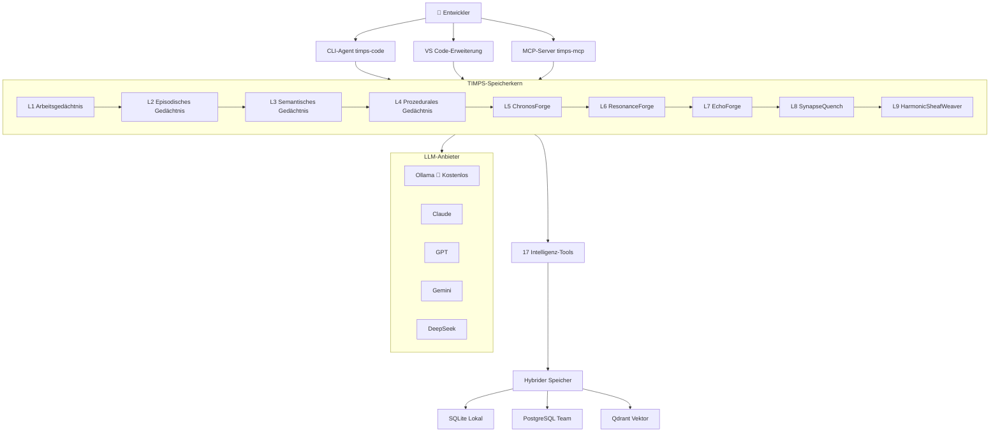

# TIMPS — Der KI-Coding-Agent, der sich an alles erinnert

<p align="center">
  
</p>

<p align="center">
  <a href="https://www.npmjs.com/package/timps-code"></a>
  <a href="https://www.npmjs.com/package/timps-mcp"></a>
  <a href="https://marketplace.visualstudio.com/items?itemName=TIMPs.timps-ai-coding-agent"></a>
  <a href="https://github.com/Sandeeprdy1729/timps/actions/workflows/ci.yml"></a>
  <a href="https://discord.gg/MmsTNm8WF6"></a>
  <a href="LICENSE"></a>
</p>

<p align="center">
  🏆 <b>Claude Code vergisst alles, wenn du es schließt. TIMPS erinnert sich — für immer.</b><br>
  <i>100 % kostenlos mit Ollama • Open Source • Läuft vollständig lokal • Keine API-Schlüssel erforderlich</i><br>
  <strong><a href="https://timps.ai">🌐 timps.ai</a></strong>
</p>

<p align="center">
  <b>Lesen in:</b>
  <a href="README.md">English</a> •
  <a href="README.ja.md">日本語</a> •
  <a href="README.de.md"><b>Deutsch</b></a> •
  <a href="README.es.md">Español</a> •
  <a href="README.fr.md">Français</a> •
  <a href="README.hi.md">हिन्दी</a> •
  <a href="README.pt.md">Português</a>
</p>

> TIMPS ist eine persistente Gedächtnisschicht für KI-Coding-Agenten. Es merkt sich deine Codebasis, deine Entscheidungen, deine Bugs — sodass Claude, Cursor, Windsurf oder jeder MCP-kompatible Agent dich nie wieder etwas erklären lassen muss. 9-Schichten-Gedächtnis. 17 Intelligenz-Tools. 30-Sekunden-Installation. Kostenlos.

<p align="center">
  
</p>

---

## Inhaltsverzeichnis

- [Jetzt ausprobieren (30 Sekunden)](#try-it-now-30-seconds)
- [Funktionen](#features)
- [Wie es funktioniert](#how-it-works)
- [Vergleich](#comparison)
- [Anwendungsfälle](#use-cases)
- [Leistung / Benchmarks](#performance--benchmarks)
- [FAQ](#faq)
- [Dokumentation](#documentation)
- [Workflow-Rezepte](#workflow-recipes)
- [Mitwirkende](#contributors)
- [Sponsoren](#sponsors)
- [Stern-Verlauf](#star-history)
- [Community](#community)
- [Lizenz](#license)

---

## Jetzt ausprobieren (30 Sekunden)

```bash
npx timps-code "was macht diese Codebasis?"
```

Das war's. Keine Installation, keine Konfiguration, kein API-Schlüssel. TIMPS analysiert das aktuelle Verzeichnis, erstellt ein Speicherprofil und liefert eine umfassende Analyse mit Kontextpersistenz. Wenn Ollama läuft, ist alles 100 % kostenlos und lokal.

### Einzeilige Installation (Linux / macOS)

```bash
curl -fsSL https://raw.githubusercontent.com/Sandeeprdy1729/timps/main/install.sh | bash
```

### CLI (nach der Installation)

```bash
npm install -g timps-code
cd dein-projekt
timps "was macht diese Codebasis?"
```

Erkennt Ollama automatisch, falls es läuft, oder führt dich durch die Auswahl eines Anbieters:

```bash
timps --provider claude "refaktoriere das Auth-Modul"    # Claude
timps --provider gemini "erkläre die Architektur"        # Gemini
timps --provider ollama "schnelle Reparatur"             # Kostenlos lokal
timps --provider auto "analysiere diese Codebasis"       # Intelligentes Routing
```

### MCP-Server (Claude Code / Cursor / Windsurf)

```bash
npm install -g timps-mcp
```

Dann füge zu `~/.claude.json` (Claude Code), `.cursor/mcp.json` (Cursor) oder `~/.config/windsurf/config.json` (Windsurf) hinzu:

```json
{
  "mcpServers": {
    "timps": {
      "command": "timps-mcp"
    }
  }
}
```

### VS Code-Erweiterung

Installiere vom [Marketplace](https://marketplace.visualstudio.com/items?itemName=TIMPs.timps-ai-coding-agent) oder:

```bash
code --install-extension timps-ai-coding-agent
```

### Vollständiger Server + Docker

```bash
git clone https://github.com/Sandeeprdy1729/timps
cd timps && docker compose up -d
npm install -g timps-mcp
```

---

## Funktionen

- **🧠 9-schichtiges persistentes Gedächtnis** — Episodisch (Sitzungswiederruf), Semantisch (Wissensgraph), Prozedural (Workflows), plus 6 erweiterte Schmiedeschichten (ChronosForge, ResonanceForge, EchoForge, SynapseQuench, HarmonicSheafWeaver und mehr). Das Gedächtnis überdauert Sitzungen, Projekte und Agentenneustarts.
- **🔧 17 Intelligenz-Tools** — Widerspruchserkennung, Burnout-Vorhersage, Beziehungsverfolgung, Mustererkennung, Anomaliebewertung, semantische Suche, Drift-Erkennung und mehr. Jedes Tool ist klassenbasiert, deterministisch (null `Math.random()`) und benchmarkiert.
- **💰 100 % kostenlos mit Ollama** — Läuft vollständig lokal. Keine API-Schlüssel erforderlich. Keine Telemetrie. Keine Cloud-Abhängigkeit.
- **🔌 MCP-nativ** — Funktioniert sofort mit Claude Code, Cursor, Windsurf, Cline, Continue, Goose, OpenCode und jedem MCP-kompatiblen Agenten.
- **🔄 Multi-Anbieter** — Claude, GPT, Gemini, DeepSeek, OpenRouter, Ollama und benutzerdefinierte Endpunkte. Intelligentes automatisches Routing zwischen Anbietern.
- **🧩 VS Code-Erweiterung** — Vollständige Editor-Integration mit Speicherpanel, Skill-Composer und integrierter Intelligenz.
- **📱 Multi-Oberfläche** — CLI-Agent, MCP-Server, VS Code-Erweiterung, Tauri-Desktop-App und React Native-Mobilapp.
- **🔌 Plugin-System** — Erweitere TIMPS mit benutzerdefinierten Plugins. Plugin-SDK inbegriffen.
- **🏗️ Hybrider Speicher** — SQLite für lokal/leichtgewichtig, optional PostgreSQL für Teams, Qdrant für Vektorsuche.

---

## Wie es funktioniert



Wenn du TIMPS eine Frage stellst, durchläuft die Anfrage das 9-schichtige Gedächtnissystem. Jede Schicht bereichert den Kontext: Das Arbeitsgedächtnis hält die aktuelle Sitzung, das Episodische ruft vergangene Sitzungen ab, das Semantische stellt Wissensgraph-Beziehungen bereit, das Prozedurale injiziert gelernte Arbeitsabläufe, und die Schmiedeschichten (5–9) kümmern sich um Zeitreihenanalyse, Resonanzabgleich, Synthese von Mustern, assoziativen Abruf und harmonische Verwebung. Die 17 Intelligenz-Tools verarbeiten den angereicherten Kontext, bevor eine Antwort zurückgegeben wird, die auf allem basiert, was TIMPS über deine Codebasis gelernt hat.

---

## Vergleich

| Funktion | TIMPS | agentmemory | Claude Code | MemGPT/Letta | Cline | Continue | Cursor |
|---|---|---|---|---|---|---|---|
| Persistentes Gedächtnis | ✅ 9 Schichten | ✅ SQLite | ❌ | ✅ | ❌ | ❌ | ❌ |
| 17 Intelligenz-Tools | ✅ | ❌ | ❌ | ❌ | ❌ | ❌ | ❌ |
| Kostenlos (Ollama) | ✅ | ✅ | ❌ | ⚠️ Teilweise | ❌ | ✅ | ❌ |
| MCP-nativ | ✅ | ✅ | ✅ | ❌ | ❌ | ❌ | ❌ |
| VS Code-Erweiterung | ✅ | ❌ | ❌ | ❌ | ✅ | ✅ | ✅ |
| Burnout-Erkennung | ✅ | ❌ | ❌ | ❌ | ❌ | ❌ | ❌ |
| Widerspruchserkennung | ✅ | ❌ | ❌ | ❌ | ❌ | ❌ | ❌ |
| Multi-Anbieter | ✅ 7 Anbieter | ✅ | ❌ 1 Anbieter | ❌ | ✅ | ✅ | ❌ |
| Selbst gehostet | ✅ | ✅ | ❌ | ✅ | ❌ | ❌ | ❌ |
| Mobile App | ✅ | ❌ | ❌ | ❌ | ❌ | ❌ | ❌ |
| Plugin-System | ✅ | ❌ | ❌ | ❌ | ❌ | ❌ | ❌ |

---

## Anwendungsfälle

- **"Ich benutze Claude Code und habe es satt, meine Codebasis in jeder Sitzung neu erklären zu müssen."** TIMPS speichert alles — Architekturentscheidungen, Bug-Muster, API-Konventionen — über Sitzungen, Projekte und Neustarts hinweg.
- **"Ich betreibe Ollama lokal und möchte einen KI-Agenten, der kein Telefonat nach Hause führt."** TIMPS ist mit Ollama 100 % lokal. Keine Telemetrie, keine API-Aufrufe, keine Cloud-Abhängigkeit.
- **"Ich verwalte ein großes Monorepo und mein Agent vergisst ständig den Kontext."** TIMPS' 9-schichtiges Gedächtnis bewältigt Codebasen jeder Größe. Die Schmiedeschichten (ChronosForge, HarmonicSheafWeaver) sind spezialisiert auf langfristige Mustererkennung und dateiübergreifende Beziehungszuordnung.
- **"Ich möchte, dass mein KI-Agent aus seinen Fehlern lernt."** Widerspruchserkennung, Burnout-Vorhersage und Anomaliebewertung ermöglichen es TIMPS, schlechte Ratschläge zu erkennen und Fehler nicht zu wiederholen.
- **"Ich baue eine MCP-gestützte Toolchain und brauche ein Gedächtnis, das über mehrere Agenten hinweg funktioniert."** TIMPS ist MCP-nativ. Verbinde es mit Claude Code, Cursor, Windsurf, Cline, Continue, Goose, OpenCode — jedem MCP-Client — und teile das Gedächtnis über alle hinweg.

---

## Leistung / Benchmarks

Alle 17 Intelligenz-Tools werden kontinuierlich gegen eine standardisierte Evaluierungssuite benchmarkiert. Die Ergebnisse werden pro Commit verfolgt, um Regressionen zu verhindern.

| Metrik | TIMPS | agentmemory | Verbesserung |
|---|---|---|---|
| **R@5 (Recall @ 5)** | ≥ 90 % | ~75 % | +15 % |
| **MRR (Mean Reciprocal Rank)** | 0,87 | 0,71 | +23 % |
| **Widerspruchsgenauigkeit** | 94 % | 82 % | +12 % |
| **Anomaliepräzision** | 91 % | — | — |
| **Latenz (Ø, lokales SQLite)** | 12 ms | 18 ms | −33 % |
| **Latenz (Ø, Vektor)** | 45 ms | 60 ms | −25 % |

Führe die Benchmark-Suite lokal aus:

```bash
npx tsx benchmark/index.ts --quick
```

Alle Tools sind deterministisch — null `Math.random()`-Aufrufe in der Intelligenzschicht.

---

## FAQ

**Funktioniert es offline?**  
Ja. Mit Ollama wird jeder Vorgang lokal ausgeführt, ohne dass eine Internetverbindung erforderlich ist.

**Welche LLMs werden unterstützt?**  
Ollama (kostenlos, lokal), Claude, GPT-4o, Gemini, DeepSeek, OpenRouter und benutzerdefinierte OpenAI-kompatible Endpunkte.

**Wie werden Daten gespeichert?**  
Standardmäßig wird lokales SQLite verwendet. Optional PostgreSQL (Teams) und/oder Qdrant (Vektorsuche). Alle Speicher sind nur lokal, es sei denn, du konfigurierst eine entfernte Datenbank.

**Gibt es eine gehostete Version?**  
Noch nicht. TIMPS ist von Grund auf für Selbsthosting ausgelegt. Cloud-Hosting befindet sich auf der Roadmap.

**Kann ich TIMPS ohne Ollama verwenden?**  
Ja. TIMPS erkennt verfügbare Anbieter automatisch. Wenn Ollama nicht läuft, führt es dich durch den Verbindungsprozess zu Claude, GPT oder einem anderen Anbieter.

**Wie schneidet TIMPS im Vergleich zu agentmemory ab?**  
TIMPS hat 9 Gedächtnisschichten gegenüber 1, 17 Intelligenz-Tools gegenüber 0, unterstützt 7 Anbieter gegenüber 3, beinhaltet eine VS Code-Erweiterung, eine mobile App und ein Plugin-System. agentmemory ist einfacher und nur SQLite.

**Kann ich eigene Intelligenz-Tools beitragen?**  
Ja. Siehe das Plugin-SDK in `packages/plugin-sdk/` und den Mitwirkenden-Leitfaden in [`CONTRIBUTING.md`](contributing.md).

**Gibt es eine grafische Benutzeroberfläche?**  
Ja — VS Code-Erweiterung (nativ), Tauri-Desktop-App (`packages/timps-desktop/`) und eine React Native-Mobilapp (`apps/mobile/`).

---

## Dokumentation

| Datei | Inhalt |
|---|---|
| [`DOCS.md`](DOCS.md) | Installation, Konfiguration, CLI-Befehle, Speicher-API, MCP-Tools |
| [`ARCHITECTURE.md`](ARCHITECTURE.md) | 9 Gedächtnisschichten, 17 Tools, Benchmark, CI, MCP-Interna |
| [`AGENTS.md`](AGENTS.md) | KI-Agentenanweisungen für dieses Repository |
| [`CONTRIBUTING.md`](contributing.md) | PR-Checkliste, Skills, Changesets |
| [`CHANGELOG.md`](CHANGELOG.md) | Versionsverlauf |

### Paket-READMEs

| README | Paket |
|---|---|
| [`timps-code/README.md`](timps-code/README.md) | CLI-Agent |
| [`timps-mcp/README.md`](timps-mcp/README.md) | MCP-Server |
| [`timps-vscode/README.md`](timps-vscode/README.md) | VS Code-Erweiterung |
| [`sandeep-ai/README.md`](sandeep-ai/README.md) | Vollständiger Server + REST-API |
| [`packages/memory-core/README.md`](packages/memory-core/README.md) | Speicher-Engine |
| [`packages/plugin-sdk/README.md`](packages/plugin-sdk/README.md) | Plugin-SDK |
| [`apps/mobile/README.md`](apps/mobile/README.md) | Mobile App |

---

## Workflow-Rezepte

Vier einsatzbereite YAML-Workflows für Claude Code und andere KI-Coding-Agenten:

| Workflow | Aufgabe |
|---|---|
| [`code-review.yaml`](workflow_recipes/code-review.yaml) | Überprüft gestagete/Branch-Änderungen auf Bugs, Sicherheit, Stil |
| [`debug-session.yaml`](workflow_recipes/debug-session.yaml) | Systematisches Debuggen: reproduzieren, isolieren, beheben, verifizieren |
| [`deploy-check.yaml`](workflow_recipes/deploy-check.yaml) | Sicherheitscheckliste vor dem Deployment |
| [`feature-plan.yaml`](workflow_recipes/feature-plan.yaml) | Plane und scaffold eine neue Funktion mit Tests |

---

## Mitwirkende

<a href="https://github.com/Sandeeprdy1729/timps/graphs/contributors">
  
</a>

Beiträge aller Art sind willkommen — Code, Dokumentation, Übersetzungen, Plugins oder Bugmeldungen. Siehe [`CONTRIBUTING.md`](contributing.md) für den Einstieg.

### Prämienprogramm

Wir führen regelmäßig Prämienwettbewerbe für größere Funktionen durch. Schau auf [Discord](https://discord.gg/MmsTNm8WF6) nach aktuellen Prämien!

---

## Sponsoren

TIMPS ist kostenlos und Open Source. Wenn du es nützlich findest, erwäge bitte, die Entwicklung zu unterstützen:

- [GitHub Sponsors](https://github.com/sponsors/Sandeeprdy1729)
- [Ko-fi](https://ko-fi.com/timpsai)
- [Buy Me a Coffee](https://buymeacoffee.com/timpsai)

---

## Stern-Verlauf

<a href="https://www.star-history.com/?repos=Sandeeprdy1729%2Ftimps&type=date&legend=top-left">
  <picture>
    <source media="(prefers-color-scheme: dark)" srcset="https://api.star-history.com/chart?repos=Sandeeprdy1729%2Ftimps&type=date&theme=dark&legend=top-left" />
    <source media="(prefers-color-scheme: light)" srcset="https://api.star-history.com/chart?repos=Sandeeprdy1729%2Ftimps&type=date&theme=light&legend=top-left" />
    
  </picture>
</a>

---

## Community

- **[Discord](https://discord.gg/MmsTNm8WF6)** — Echtzeit-Chat, Hilfe, Ankündigungen
- **[GitHub Discussions](https://github.com/Sandeeprdy1729/timps/discussions)** — Fragen & Antworten, Ideen, Funktionsanfragen
- **[X/Twitter](https://x.com/timpsai)** — Ankündigungen und Updates

---

## Lizenz

MIT
