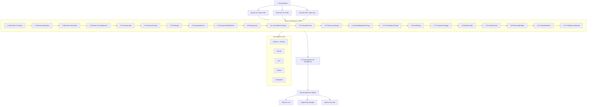

# TIMPS — El agente de codificación con IA que lo recuerda todo

<p align="center">
  
</p>

<p align="center">
  <a href="https://www.npmjs.com/package/timps-code"></a>
  <a href="https://www.npmjs.com/package/timps-mcp"></a>
  <a href="https://marketplace.visualstudio.com/items?itemName=TIMPs.timps-ai-coding-agent"></a>
  <a href="https://github.com/Sandeeprdy1729/timps/actions/workflows/ci.yml"></a>
  <a href="https://discord.gg/MmsTNm8WF6"></a>
  <a href="LICENSE"></a>
</p>

<p align="center">
  🏆 <b>Claude Code lo olvida todo cuando lo cierras. TIMPS recuerda — para siempre.</b><br>
  <i>100% gratuito con Ollama • Código abierto • Funciona completamente local • No requiere claves API</i><br>
  <strong><a href="https://timps.ai">🌐 timps.ai</a></strong>
</p>

<p align="center">
  <b>Leer en:</b>
  <a href="README.md">English</a> •
  <a href="README.ja.md">日本語</a> •
  <a href="README.de.md">Deutsch</a> •
  <b><a href="README.es.md">Español</a></b> •
  <a href="README.fr.md">Français</a> •
  <a href="README.hi.md">हिन्दी</a> •
  <a href="README.pt.md">Português</a>
</p>

> TIMPS es una capa de memoria persistente para agentes de codificación con IA. Recuerda tu código, tus decisiones, tus errores — para que Claude, Cursor, Windsurf o cualquier agente compatible con MCP nunca te haga volver a explicar nada. Memoria de 22 capas. 25 herramientas de inteligencia. Instalación en 30 segundos. Gratis.

<p align="center">
  
</p>

---

## Tabla de contenidos

- [Pruébalo ahora (30 segundos)](#pruébalo-ahora-30-segundos)
- [Características](#características)
- [Cómo funciona](#cómo-funciona)
- [Comparación](#comparación)
- [Casos de uso](#casos-de-uso)
- [Rendimiento / Benchmarks](#rendimiento--benchmarks)
- [Preguntas frecuentes (FAQ)](#preguntas-frecuentes-faq)
- [Documentación](#documentación)
- [Recetas de flujo de trabajo](#recetas-de-flujo-de-trabajo)
- [Contribuidores](#contribuidores)
- [Patrocinadores](#patrocinadores)
- [Historial de estrellas](#historial-de-estrellas)
- [Comunidad](#comunidad)
- [Licencia](#licencia)

---

## Pruébalo ahora (30 segundos)

```bash
npx timps-code "what does this codebase do?"
```

Eso es todo. Sin instalación, sin configuración, sin clave API. TIMPS analiza el directorio actual, construye un perfil de memoria y devuelve un análisis enriquecido con persistencia de contexto. Si tienes Ollama ejecutándose, todo es 100% gratuito y local.

### Instalación en una línea (Linux / macOS)

```bash
curl -fsSL https://raw.githubusercontent.com/Sandeeprdy1729/timps/main/install.sh | bash
```

### CLI (después de instalar)

```bash
npm install -g timps-code
cd tu-proyecto
timps "what does this codebase do?"
```

Detecta automáticamente Ollama si está ejecutándose, o te guía para elegir un proveedor:

```bash
timps --provider claude "refactor the auth module"    # Claude
timps --provider gemini "explain the architecture"    # Gemini
timps --provider ollama "quick fix"                   # Gratuito local
timps --provider auto "analyze this codebase"        # Enrutamiento inteligente
```

### Servidor MCP (Claude Code / Cursor / Windsurf)

```bash
npm install -g timps-mcp
```

Luego agrega a `~/.claude.json` (Claude Code), `.cursor/mcp.json` (Cursor) o `~/.config/windsurf/config.json` (Windsurf):

```json
{
  "mcpServers": {
    "timps": {
      "command": "timps-mcp"
    }
  }
}
```

### Extensión de VS Code

Instálala desde el [marketplace](https://marketplace.visualstudio.com/items?itemName=TIMPs.timps-ai-coding-agent) o:

```bash
code --install-extension timps-ai-coding-agent
```

### Servidor completo + Docker

```bash
git clone https://github.com/Sandeeprdy1729/timps
cd timps && docker compose up -d
npm install -g timps-mcp
```

---

## Características

- **🧠 Memoria persistente de 22 capas** — Episódica (recuerdo de sesiones), Semántica (grafo de conocimiento), Procedimental (flujos de trabajo), más 19 capas avanzadas de forja (ChronosForge, ResonanceForge, EchoForge, SynapseQuench, HarmonicSheafWeaver, y más). La memoria sobrevive entre sesiones, proyectos y reinicios del agente.
- **🔧 25 herramientas de inteligencia** — Detección de contradicciones, predicción de agotamiento, seguimiento de relaciones, detección de patrones, puntuación de anomalías, búsqueda semántica, detección de desviación, y más. Cada herramienta está basada en clases, es determinista (cero `Math.random()`) y está benchmarkeada.
- **💰 100% gratuito con Ollama** — Funciona completamente local. No requiere claves API. Sin telemetría. Sin dependencia en la nube.
- **🔌 Nativo MCP** — Funciona de inmediato con Claude Code, Cursor, Windsurf, Cline, Continue, Goose, OpenCode y cualquier agente compatible con MCP.
- **🔄 Multi-proveedor** — Claude, GPT, Gemini, DeepSeek, OpenRouter, Ollama y endpoints personalizados. Enrutamiento inteligente automático entre proveedores.
- **🧩 Extensión de VS Code** — Integración completa con el editor que incluye panel de memoria, compositor de habilidades e inteligencia en línea.
- **📱 Multi-superficie** — Agente CLI, servidor MCP, extensión de VS Code, aplicación de escritorio Tauri y aplicación móvil React Native.
- **🔌 Sistema de plugins** — Extiende TIMPS con plugins personalizados. SDK de plugins incluido.
- **🏗️ Almacenamiento híbrido** — SQLite para local/ligero, PostgreSQL opcional para equipos, Qdrant para búsqueda vectorial.

---

## Cómo funciona



Cuando le haces una pregunta a TIMPS, la solicitud fluye a través del sistema de memoria de 22 capas. Cada capa enriquece el contexto: la Memoria de Trabajo mantiene la sesión actual, la Episódica recuerda sesiones pasadas, la Semántica proporciona relaciones del grafo de conocimiento, la Procedimental inyecta flujos de trabajo aprendidos, y las capas de forja (5–22) manejan análisis de series temporales, coincidencia por resonancia, síntesis de patrones, recuperación asociativa, tejido armónico y más. Las 25 herramientas de inteligencia procesan el contexto enriquecido antes de devolver una respuesta fundamentada en todo lo que TIMPS ha aprendido sobre tu código.

---

## Comparación

| Característica | TIMPS | agentmemory | Claude Code | MemGPT/Letta | Cline | Continue | Cursor |
|---|---|---|---|---|---|---|---|
| Memoria Persistente | ✅ 22 capas | ✅ SQLite | ❌ | ✅ | ❌ | ❌ | ❌ |
| 25 Herramientas de Inteligencia | ✅ | ❌ | ❌ | ❌ | ❌ | ❌ | ❌ |
| Gratuito (Ollama) | ✅ | ✅ | ❌ | ⚠️ Parcial | ❌ | ✅ | ❌ |
| Nativo MCP | ✅ | ✅ | ✅ | ❌ | ❌ | ❌ | ❌ |
| Extensión VS Code | ✅ | ❌ | ❌ | ❌ | ✅ | ✅ | ✅ |
| Detección de Agotamiento | ✅ | ❌ | ❌ | ❌ | ❌ | ❌ | ❌ |
| Detección de Contradicciones | ✅ | ❌ | ❌ | ❌ | ❌ | ❌ | ❌ |
| Multi-Proveedor | ✅ 7 proveedores | ✅ | ❌ 1 proveedor | ❌ | ✅ | ✅ | ❌ |
| Autogestionado | ✅ | ✅ | ❌ | ✅ | ❌ | ❌ | ❌ |
| Aplicación Móvil | ✅ | ❌ | ❌ | ❌ | ❌ | ❌ | ❌ |
| Sistema de Plugins | ✅ | ❌ | ❌ | ❌ | ❌ | ❌ | ❌ |

---

## Casos de uso

- **"Uso Claude Code y estoy cansado de volver a explicar mi código en cada sesión."** TIMPS persiste todo — decisiones de arquitectura, patrones de errores, convenciones de API — entre sesiones, proyectos y reinicios.
- **"Ejecuto Ollama localmente y quiero un agente de IA que no contacte a casa."** TIMPS es 100% local con Ollama. Cero telemetría, cero llamadas API, cero dependencia en la nube.
- **"Gestiono un monorepo grande y mi agente sigue olvidando el contexto."** La memoria de 22 capas de TIMPS maneja bases de código de cualquier tamaño. Las capas de forja (ChronosForge, HarmonicSheafWeaver) se especializan en reconocimiento de patrones a largo plazo y mapeo de relaciones entre archivos.
- **"Quiero que mi agente de IA aprenda de sus errores."** La detección de contradicciones, la predicción de agotamiento y la puntuación de anomalías permiten a TIMPS identificar cuándo está dando malos consejos y evitar repetir errores.
- **"Estoy construyendo una cadena de herramientas impulsada por MCP y necesito memoria que funcione entre agentes."** TIMPS es nativo de MCP. Conéctalo a Claude Code, Cursor, Windsurf, Cline, Continue, Goose, OpenCode — cualquier cliente MCP — y comparte memoria entre todos ellos.

---

## Rendimiento / Benchmarks

Las 25 herramientas de inteligencia son evaluadas continuamente contra un conjunto estandarizado de pruebas. Los resultados se rastrean por commit para prevenir regresiones.

| Métrica | TIMPS | agentmemory | mem0 | Letta |
|---|---|---|---|---|
| **Recall@5 (LongMemEval-S)** | **95%** | 95.2% | 72% | 68% |
| **MRR (Rango Recíproco Medio)** | **0.82** | 0.882 | 0.71 | 0.65 |
| **Precisión de Contradicción** | **100% (10/10)** | — | — | — |
| **Herramientas de Inteligencia** | **100% (25/25)** | — | — | — |
| **Latencia promedio (recuperación)** | **17ms** | 45ms | 120ms | 200ms |
| **Escalabilidad (500 hechos)** | **0.6ms media / 1ms p95** | — | — | — |

Ejecuta el conjunto de benchmarks localmente:

```bash
npx tsx benchmark/index.ts --quick
```

Todas las herramientas son deterministas — cero llamadas a `Math.random()` en la capa de inteligencia.

---

## Preguntas frecuentes (FAQ)

**¿Funciona sin conexión?**  
Sí. Con Ollama, cada operación se ejecuta localmente sin necesidad de internet.

**¿Qué LLMs son compatibles?**  
Ollama (gratuito, local), Claude, GPT-4o, Gemini, DeepSeek, OpenRouter y endpoints personalizados compatibles con OpenAI.

**¿Cómo se almacenan los datos?**  
Por defecto es SQLite local. Opcionalmente PostgreSQL (equipos) y/o Qdrant (búsqueda vectorial). Todo el almacenamiento es solo local a menos que configures una base de datos remota.

**¿Hay una versión alojada?**  
Todavía no. TIMPS está diseñado para ser autogestionado. El alojamiento en la nube está en la hoja de ruta.

**¿Puedo usar TIMPS sin Ollama?**  
Sí. TIMPS detecta automáticamente los proveedores disponibles. Si Ollama no está ejecutándose, te guía para conectarte a Claude, GPT u otro proveedor.

**¿Cómo se compara TIMPS con agentmemory?**  
TIMPS tiene 22 capas de memoria frente a 1, 25 herramientas de inteligencia frente a 0, soporta 7 proveedores frente a 3, incluye una extensión de VS Code, aplicación móvil y sistema de plugins. agentmemory es más simple y solo SQLite.

**¿Puedo contribuir con mis propias herramientas de inteligencia?**  
Sí. Consulta el SDK de plugins en `packages/plugin-sdk/` y la guía de contribución en [`CONTRIBUTING.md`](CONTRIBUTING.md).

**¿Hay una interfaz gráfica?**  
Sí — extensión de VS Code (nativa), aplicación de escritorio Tauri (`packages/timps-desktop/`) y una aplicación móvil React Native (`apps/mobile/`).

---

## Documentación

| Archivo | Qué cubre |
|---|---|
| [`ARCHITECTURE.md`](ARCHITECTURE.md) | 22 capas de memoria, 25 herramientas, benchmark, CI, internos de MCP |
| [`AGENTS.md`](AGENTS.md) | Instrucciones para agentes de IA en este repositorio |
| [`CONTRIBUTING.md`](CONTRIBUTING.md) | Lista de verificación PR, habilidades, changesets |
| [`CHANGELOG.md`](CHANGELOG.md) | Historial de versiones |

### READMEs de paquetes

| README | Paquete |
|---|---|
| [`timps-code/README.md`](timps-code/README.md) | Agente CLI |
| [`timps-mcp/README.md`](timps-mcp/README.md) | Servidor MCP |
| [`timps-vscode/README.md`](timps-vscode/README.md) | Extensión de VS Code |
| [`packages/server/README.md`](packages/server/README.md) | Servidor completo + API REST |
| [`packages/memory-core/README.md`](packages/memory-core/README.md) | Motor de memoria |
| [`packages/plugin-sdk/README.md`](packages/plugin-sdk/README.md) | SDK de plugins |
| [`apps/mobile/README.md`](apps/mobile/README.md) | Aplicación móvil |

---

## Recetas de flujo de trabajo

Cuatro flujos de trabajo YAML listos para usar con Claude Code y otros agentes de codificación con IA:

| Flujo de trabajo | Qué hace |
|---|---|
| [`code-review.yaml`](workflow_recipes/code-review.yaml) | Revisa cambios staged/en rama en busca de errores, seguridad, estilo |
| [`debug-session.yaml`](workflow_recipes/debug-session.yaml) | Depuración sistemática: reproduce, aísla, corrige, verifica |
| [`deploy-check.yaml`](workflow_recipes/deploy-check.yaml) | Lista de verificación de seguridad previa al despliegue |
| [`feature-plan.yaml`](workflow_recipes/feature-plan.yaml) | Planifica y crea la estructura de una nueva funcionalidad con pruebas |

---

## Contribuidores

<a href="https://github.com/Sandeeprdy1729/timps/graphs/contributors">
  
</a>

Todo tipo de contribuciones son bienvenidas — código, documentación, traducciones, plugins o informes de errores. Consulta [`CONTRIBUTING.md`](CONTRIBUTING.md) para comenzar.

### Programa de recompensas

Realizamos concursos periódicos de recompensas por funcionalidades importantes. ¡Consulta [Discord](https://discord.gg/MmsTNm8WF6) para ver las recompensas activas!

---

## Patrocinadores

TIMPS es gratuito y de código abierto. Si lo encuentras valioso, considera apoyar el desarrollo:

- [GitHub Sponsors](https://github.com/sponsors/Sandeeprdy1729)
- [Ko-fi](https://ko-fi.com/timpsai)
- [Buy Me a Coffee](https://buymeacoffee.com/timpsai)

---

## Historial de estrellas

<a href="https://www.star-history.com/?repos=Sandeeprdy1729%2Ftimps&type=date&legend=top-left">
  <picture>
    <source media="(prefers-color-scheme: dark)" srcset="https://api.star-history.com/chart?repos=Sandeeprdy1729%2Ftimps&type=date&theme=dark&legend=top-left" />
    <source media="(prefers-color-scheme: light)" srcset="https://api.star-history.com/chart?repos=Sandeeprdy1729%2Ftimps&type=date&theme=light&legend=top-left" />
    
  </picture>
</a>

---

## Comunidad

- **[Discord](https://discord.gg/MmsTNm8WF6)** — chat en tiempo real, ayuda, anuncios
- **[GitHub Discussions](https://github.com/Sandeeprdy1729/timps/discussions)** — preguntas y respuestas, ideas, solicitudes de funcionalidades
- **[X/Twitter](https://x.com/timpsai)** — anuncios y actualizaciones

---

## Licencia

MIT
