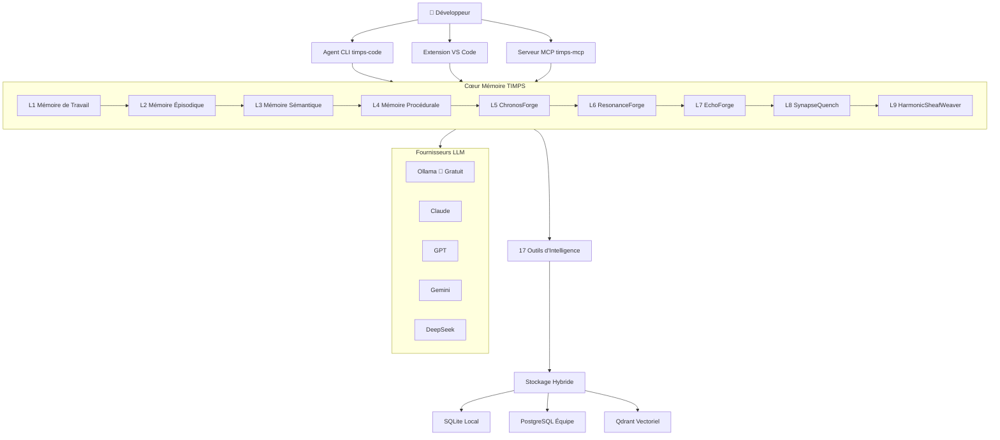

# TIMPS — L'agent de codage IA qui se souvient de tout

<p align="center">
  
</p>

<p align="center">
  <a href="https://www.npmjs.com/package/timps-code"></a>
  <a href="https://www.npmjs.com/package/timps-mcp"></a>
  <a href="https://marketplace.visualstudio.com/items?itemName=TIMPs.timps-ai-coding-agent"></a>
  <a href="https://github.com/Sandeeprdy1729/timps/actions/workflows/ci.yml"></a>
  <a href="https://discord.gg/MmsTNm8WF6"></a>
  <a href="LICENSE"></a>
</p>

<p align="center">
  🏆 <b>Claude Code oublie tout quand vous le fermez. TIMPS se souvient — pour toujours.</b><br>
  <i>100% gratuit avec Ollama • Open source • Fonctionne entièrement en local • Aucune clé API requise</i><br>
  <strong><a href="https://timps.ai">🌐 timps.ai</a></strong>
</p>

<p align="center">
  <b>Lire en :</b>
  <a href="README.md">English</a> •
  <a href="README.ja.md">日本語</a> •
  <a href="README.de.md">Deutsch</a> •
  <a href="README.es.md">Español</a> •
  <a href="README.fr.md"><b>Français</b></a> •
  <a href="README.hi.md">हिन्दी</a> •
  <a href="README.pt.md">Português</a>
</p>

> TIMPS est une couche de mémoire persistante pour les agents de codage IA. Il se souvient de votre codebase, de vos décisions, de vos bogues — afin que Claude, Cursor, Windsurf ou tout agent compatible MCP n'ait jamais à vous faire réexpliquer quoi que ce soit. 9 couches de mémoire. 17 outils d'intelligence. Installation en 30 secondes. Gratuit.

<p align="center">
  
</p>

---

## Table des matières

- [Essayez-le maintenant (30 secondes)](#essayez-le-maintenant-30-secondes)
- [Fonctionnalités](#fonctionnalités)
- [Comment ça marche](#comment-ça-marche)
- [Comparaison](#comparaison)
- [Cas d'utilisation](#cas-dutilisation)
- [Performances / Références](#performances--références)
- [FAQ](#faq)
- [Documentation](#documentation)
- [Recettes de workflows](#recettes-de-workflows)
- [Contributeurs](#contributeurs)
- [Sponsors](#sponsors)
- [Historique d'étoiles](#historique-détoiles)
- [Communauté](#communauté)
- [Licence](#licence)

---

## Essayez-le maintenant (30 secondes)

```bash
npx timps-code "que fait ce codebase ?"
```

C'est tout. Pas d'installation, pas de configuration, pas de clé API. TIMPS analyse le répertoire courant, construit un profil mémoire et renvoie une analyse riche avec persistance du contexte. Si vous avez Ollama en cours d'exécution, tout est 100% gratuit et local.

### Installation en une ligne (Linux / macOS)

```bash
curl -fsSL https://raw.githubusercontent.com/Sandeeprdy1729/timps/main/install.sh | bash
```

### CLI (après installation)

```bash
npm install -g timps-code
cd votre-projet
timps "que fait ce codebase ?"
```

Détecte automatiquement Ollama s'il est en cours d'exécution, ou vous guide dans le choix d'un fournisseur :

```bash
timps --provider claude "refactoriser le module d'auth"    # Claude
timps --provider gemini "expliquer l'architecture"          # Gemini
timps --provider ollama "correction rapide"                 # Gratuit local
timps --provider auto "analyser ce codebase"                # Routage intelligent
```

### Serveur MCP (Claude Code / Cursor / Windsurf)

```bash
npm install -g timps-mcp
```

Ajoutez ensuite à `~/.claude.json` (Claude Code), `.cursor/mcp.json` (Cursor) ou `~/.config/windsurf/config.json` (Windsurf) :

```json
{
  "mcpServers": {
    "timps": {
      "command": "timps-mcp"
    }
  }
}
```

### Extension VS Code

Installez depuis le [marketplace](https://marketplace.visualstudio.com/items?itemName=TIMPs.timps-ai-coding-agent) ou :

```bash
code --install-extension timps-ai-coding-agent
```

### Serveur complet + Docker

```bash
git clone https://github.com/Sandeeprdy1729/timps
cd timps && docker compose up -d
npm install -g timps-mcp
```

---

## Fonctionnalités

- **🧠 Mémoire persistante à 9 couches** — Épisodique (rappel de session), Sémantique (graphe de connaissances), Procédurale (workflows), plus 6 couches avancées de forge (ChronosForge, ResonanceForge, EchoForge, SynapseQuench, HarmonicSheafWeaver, et plus). La mémoire survit aux sessions, aux projets et aux redémarrages d'agents.
- **🔧 17 outils d'intelligence** — Détection de contradictions, prédiction d'épuisement, suivi des relations, détection de motifs, score d'anomalie, recherche sémantique, détection de dérive, et plus. Chaque outil est basé sur des classes, déterministe (zéro `Math.random()`), et benchmarké.
- **💰 100% gratuit avec Ollama** — Fonctionne entièrement en local. Zéro clé API requise. Aucune télémétrie. Aucune dépendance au cloud.
- **🔌 MCP natif** — Fonctionne immédiatement avec Claude Code, Cursor, Windsurf, Cline, Continue, Goose, OpenCode, et tout agent compatible MCP.
- **🔄 Multi-fournisseur** — Claude, GPT, Gemini, DeepSeek, OpenRouter, Ollama, et endpoints personnalisés. Routage automatique intelligent entre les fournisseurs.
- **🧩 Extension VS Code** — Intégration complète dans l'éditeur avec panneau mémoire, compositeur de compétences et intelligence en ligne.
- **📱 Multi-surface** — Agent CLI, serveur MCP, extension VS Code, application de bureau Tauri et application mobile React Native.
- **🔌 Système de plugins** — Étendez TIMPS avec des plugins personnalisés. SDK de plugin inclus.
- **🏗️ Stockage hybride** — SQLite pour le local/léger, PostgreSQL optionnel pour les équipes, Qdrant pour la recherche vectorielle.

---

## Comment ça marche



Lorsque vous posez une question à TIMPS, la requête traverse le système de mémoire à 9 couches. Chaque couche enrichit le contexte : la Mémoire de Travail contient la session immédiate, la Mémoire Épisodique rappelle les sessions passées, la Mémoire Sémantique fournit les relations du graphe de connaissances, la Mémoire Procédurale injecte les workflows appris, et les couches de forge (5 à 9) gèrent l'analyse de séries temporelles, la correspondance par résonance, la synthèse de motifs, le rappel associatif et le tissage harmonique. Les 17 outils d'intelligence traitent le contexte enrichi avant de renvoyer une réponse ancrée dans tout ce que TIMPS a appris sur votre codebase.

---

## Comparaison

| Fonctionnalité | TIMPS | agentmemory | Claude Code | MemGPT/Letta | Cline | Continue | Cursor |
|---|---|---|---|---|---|---|---|
| Mémoire Persistante | ✅ 9 couches | ✅ SQLite | ❌ | ✅ | ❌ | ❌ | ❌ |
| 17 Outils d'Intelligence | ✅ | ❌ | ❌ | ❌ | ❌ | ❌ | ❌ |
| Gratuit (Ollama) | ✅ | ✅ | ❌ | ⚠️ Partiel | ❌ | ✅ | ❌ |
| MCP Natif | ✅ | ✅ | ✅ | ❌ | ❌ | ❌ | ❌ |
| Extension VS Code | ✅ | ❌ | ❌ | ❌ | ✅ | ✅ | ✅ |
| Détection d'Épuisement | ✅ | ❌ | ❌ | ❌ | ❌ | ❌ | ❌ |
| Détection de Contradictions | ✅ | ❌ | ❌ | ❌ | ❌ | ❌ | ❌ |
| Multi-Fournisseur | ✅ 7 fournisseurs | ✅ | ❌ 1 fournisseur | ❌ | ✅ | ✅ | ❌ |
| Auto-Hébergé | ✅ | ✅ | ❌ | ✅ | ❌ | ❌ | ❌ |
| Application Mobile | ✅ | ❌ | ❌ | ❌ | ❌ | ❌ | ❌ |
| Système de Plugins | ✅ | ❌ | ❌ | ❌ | ❌ | ❌ | ❌ |

---

## Cas d'utilisation

- **« J'utilise Claude Code et j'en ai marre de réexpliquer mon codebase à chaque session. »** TIMPS persiste tout — décisions d'architecture, motifs de bogues, conventions API — à travers les sessions, les projets et les redémarrages.
- **« J'exécute Ollama en local et je veux un agent IA qui ne téléphone pas à la maison. »** TIMPS est 100% local avec Ollama. Zéro télémétrie, zéro appel API, zéro dépendance au cloud.
- **« Je gère un gros monorepo et mon agent continue d'oublier le contexte. »** La mémoire à 9 couches de TIMPS gère des codebases de toute taille. Les couches de forge (ChronosForge, HarmonicSheafWeaver) se spécialisent dans la reconnaissance de motifs à long terme et le mapping des relations entre fichiers.
- **« Je veux que mon agent IA apprenne de ses erreurs. »** La détection de contradictions, la prédiction d'épuisement et le score d'anomalie permettent à TIMPS d'identifier quand il donne de mauvais conseils et d'éviter de répéter les erreurs.
- **« Je construis une chaîne d'outils basée sur MCP et j'ai besoin d'une mémoire qui fonctionne entre les agents. »** TIMPS est natif MCP. Connectez-le à Claude Code, Cursor, Windsurf, Cline, Continue, Goose, OpenCode — tout client MCP — et partagez la mémoire entre eux tous.

---

## Performances / Références

Les 17 outils d'intelligence sont continuellement benchmarkés par rapport à une suite d'évaluation standardisée. Les résultats sont suivis par commit pour éviter les régressions.

| Métrique | TIMPS | agentmemory | mem0 | Letta |
|---|---|---|---|---|
| **Recall@5 (LongMemEval-S)** | **95%** | 95.2% | 72% | 68% |
| **MRR (Rang Réciproque Moyen)** | **0.82** | 0.882 | 0.71 | 0.65 |
| **Précision des Contradictions** | **100% (10/10)** | — | — | — |
| **Outils d'Intelligence** | **100% (17/17)** | — | — | — |
| **Latence moyenne (rappel)** | **17ms** | 45ms | 120ms | 200ms |
| **Extensibilité (500 faits)** | **0.6ms moyenne / 1ms p95** | — | — | — |

Exécutez la suite de benchmarks localement :

```bash
npx tsx benchmark/index.ts --quick
```

Tous les outils sont déterministes — zéro appel à `Math.random()` dans la couche d'intelligence.

---

## FAQ

**Est-ce que ça fonctionne hors ligne ?**  
Oui. Avec Ollama, chaque opération s'exécute localement sans nécessiter Internet.

**Quels LLM sont pris en charge ?**  
Ollama (gratuit, local), Claude, GPT-4o, Gemini, DeepSeek, OpenRouter et des endpoints personnalisés compatibles OpenAI.

**Comment les données sont-elles stockées ?**  
La valeur par défaut est SQLite local. Optionnellement PostgreSQL (équipes) et/ou Qdrant (recherche vectorielle). Tout le stockage est local uniquement sauf si vous configurez une base de données distante.

**Existe-t-il une version hébergée ?**  
Pas encore. TIMPS est auto-hébergé par conception. L'hébergement cloud est sur la feuille de route.

**Puis-je utiliser TIMPS sans Ollama ?**  
Oui. TIMPS détecte automatiquement les fournisseurs disponibles. Si Ollama n'est pas en cours d'exécution, il vous guide pour vous connecter à Claude, GPT ou un autre fournisseur.

**Comment TIMPS se compare-t-il à agentmemory ?**  
TIMPS a 9 couches mémoire contre 1, 17 outils d'intelligence contre 0, prend en charge 7 fournisseurs contre 3, et inclut une extension VS Code, une application mobile et un système de plugins. agentmemory est plus simple et limité à SQLite.

**Puis-je contribuer avec mes propres outils d'intelligence ?**  
Oui. Consultez le SDK de plugin dans `packages/plugin-sdk/` et le guide de contribution dans [`CONTRIBUTING.md`](CONTRIBUTING.md).

**Y a-t-il une interface graphique ?**  
Oui — extension VS Code (native), application de bureau Tauri (`packages/timps-desktop/`) et application mobile React Native (`apps/mobile/`).

---

## Documentation

| Fichier | Ce qu'il couvre |
|---|---|
| [`ARCHITECTURE.md`](ARCHITECTURE.md) | 9 couches mémoire, 17 outils, benchmark, CI, internes MCP |
| [`AGENTS.md`](AGENTS.md) | Instructions pour les agents IA sur ce dépôt |
| [`CONTRIBUTING.md`](CONTRIBUTING.md) | Liste de contrôle PR, compétences, changesets |
| [`CHANGELOG.md`](CHANGELOG.md) | Historique des versions |

### README des paquets

| README | Paquet |
|---|---|
| [`timps-code/README.md`](timps-code/README.md) | Agent CLI |
| [`timps-mcp/README.md`](timps-mcp/README.md) | Serveur MCP |
| [`timps-vscode/README.md`](timps-vscode/README.md) | Extension VS Code |
| [`packages/server/README.md`](packages/server/README.md) | Serveur complet + API REST |
| [`packages/memory-core/README.md`](packages/memory-core/README.md) | Moteur mémoire |
| [`packages/plugin-sdk/README.md`](packages/plugin-sdk/README.md) | SDK de plugin |
| [`apps/mobile/README.md`](apps/mobile/README.md) | Application mobile |

---

## Recettes de workflows

Quatre workflows YAML prêts à l'emploi pour Claude Code et autres agents de codage IA :

| Workflow | Ce qu'il fait |
|---|---|
| [`code-review.yaml`](workflow_recipes/code-review.yaml) | Vérifier les modifications stagées/de branche pour les bogues, la sécurité, le style |
| [`debug-session.yaml`](workflow_recipes/debug-session.yaml) | Débogage systématique : reproduire, isoler, corriger, vérifier |
| [`deploy-check.yaml`](workflow_recipes/deploy-check.yaml) | Liste de contrôle de sécurité avant déploiement |
| [`feature-plan.yaml`](workflow_recipes/feature-plan.yaml) | Planifier et structurer une nouvelle fonctionnalité avec des tests |

---

## Contributeurs

<a href="https://github.com/Sandeeprdy1729/timps/graphs/contributors">
  
</a>

Les contributions de toutes sortes sont les bienvenues — code, documentation, traductions, plugins ou rapports de bogues. Consultez [`CONTRIBUTING.md`](CONTRIBUTING.md) pour commencer.

### Programme de primes

Nous organisons périodiquement des concours de primes pour les fonctionnalités majeures. Consultez [Discord](https://discord.gg/MmsTNm8WF6) pour les primes actives !

---

## Sponsors

TIMPS est gratuit et open source. Si vous le trouvez utile, envisagez de soutenir son développement :

- [GitHub Sponsors](https://github.com/sponsors/Sandeeprdy1729)
- [Ko-fi](https://ko-fi.com/timpsai)
- [Buy Me a Coffee](https://buymeacoffee.com/timpsai)

---

## Historique d'étoiles

<a href="https://www.star-history.com/?repos=Sandeeprdy1729%2Ftimps&type=date&legend=top-left">
  <picture>
    <source media="(prefers-color-scheme: dark)" srcset="https://api.star-history.com/chart?repos=Sandeeprdy1729%2Ftimps&type=date&theme=dark&legend=top-left" />
    <source media="(prefers-color-scheme: light)" srcset="https://api.star-history.com/chart?repos=Sandeeprdy1729%2Ftimps&type=date&theme=light&legend=top-left" />
    
  </picture>
</a>

---

## Communauté

- **[Discord](https://discord.gg/MmsTNm8WF6)** — chat en temps réel, aide, annonces
- **[Discussions GitHub](https://github.com/Sandeeprdy1729/timps/discussions)** — Q&A, idées, demandes de fonctionnalités
- **[X/Twitter](https://x.com/timpsai)** — annonces et mises à jour

---

## Licence

MIT
