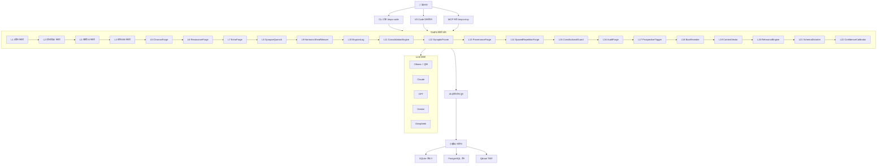

# TIMPS — AI कोडिंग एजेंट जो सब कुछ याद रखता है

<p align="center">
  
</p>

<p align="center">
  <a href="https://www.npmjs.com/package/timps-code"></a>
  <a href="https://www.npmjs.com/package/timps-mcp"></a>
  <a href="https://marketplace.visualstudio.com/items?itemName=TIMPs.timps-ai-coding-agent"></a>
  <a href="https://github.com/Sandeeprdy1729/timps/actions/workflows/ci.yml"></a>
  <a href="https://discord.gg/MmsTNm8WF6"></a>
  <a href="LICENSE"></a>
</p>

<p align="center">
  🏆 <b>Claude Code बंद करते ही सब भूल जाता है। TIMPS याद रखता है — हमेशा के लिए।</b><br>
  <i>100% मुफ्त Ollama के साथ • ओपन सोर्स • पूरी तरह से लोकल चलता है • कोई API कुंजी आवश्यक नहीं</i><br>
  <strong><a href="https://timps.ai">🌐 timps.ai</a></strong>
</p>

<p align="center">
  <b>पढ़ें:</b>
  <a href="README.md">English</a> •
  <a href="README.ja.md">日本語</a> •
  <a href="README.de.md">Deutsch</a> •
  <a href="README.es.md">Español</a> •
  <a href="README.fr.md">Français</a> •
  <b><a href="README.hi.md">हिन्दी</a></b> •
  <a href="README.pt.md">Português</a>
</p>

> TIMPS, AI कोडिंग एजेंटों के लिए एक स्थायी मेमोरी परत है। यह आपके कोडबेस, आपके निर्णय, आपकी बग्स को याद रखता है — ताकि Claude, Cursor, Windsurf, या कोई भी MCP-संगत एजेंट आपसे कभी कुछ दोबारा समझाने को न कहे। 22-परत मेमोरी। 25 इंटेलिजेंस टूल। 30 सेकंड में इंस्टॉल। मुफ्त।

<p align="center">
  
</p>

---

## विषय सूची

- [अभी आज़माएं (30 सेकंड)](#try-it-now-30-seconds)
- [विशेषताएं](#features)
- [यह कैसे काम करता है](#how-it-works)
- [तुलना](#comparison)
- [उपयोग के मामले](#use-cases)
- [प्रदर्शन / बेंचमार्क](#performance--benchmarks)
- [सामान्य प्रश्न](#faq)
- [दस्तावेज़ीकरण](#documentation)
- [वर्कफ़्लो रेसिपी](#workflow-recipes)
- [योगदानकर्ता](#contributors)
- [प्रायोजक](#sponsors)
- [स्टार इतिहास](#star-history)
- [समुदाय](#community)
- [लाइसेंस](#license)

---

## अभी आज़माएं (30 सेकंड)

```bash
npx timps-code "what does this codebase do?"
```

बस इतना ही। कोई इंस्टॉल नहीं, कोई कॉन्फ़िग नहीं, कोई API कुंजी नहीं। TIMPS वर्तमान निर्देशिका का विश्लेषण करता है, एक मेमोरी प्रोफ़ाइल बनाता है, और संदर्भ स्थिरता के साथ एक समृद्ध विश्लेषण लौटाता है। अगर आपके पास Ollama चल रहा है, तो सब कुछ 100% मुफ्त और लोकल है।

### एक-लाइन इंस्टॉल (Linux / macOS)

```bash
curl -fsSL https://raw.githubusercontent.com/Sandeeprdy1729/timps/main/install.sh | bash
```

### CLI (इंस्टॉल के बाद)

```bash
npm install -g timps-code
cd your-project
timps "what does this codebase do?"
```

यदि Ollama चल रहा है तो स्वचालित रूप से पता लगाता है, या आपको प्रदाता चुनने में मार्गदर्शन करता है:

```bash
timps --provider claude "refactor the auth module"    # Claude
timps --provider gemini "explain the architecture"    # Gemini
timps --provider ollama "quick fix"                   # मुफ्त लोकल
timps --provider auto "analyze this codebase"         # बुद्धिमान रूटिंग
```

### MCP सर्वर (Claude Code / Cursor / Windsurf)

```bash
npm install -g timps-mcp
```

फिर `~/.claude.json` (Claude Code), `.cursor/mcp.json` (Cursor), या `~/.config/windsurf/config.json` (Windsurf) में जोड़ें:

```json
{
  "mcpServers": {
    "timps": {
      "command": "timps-mcp"
    }
  }
}
```

### VS Code एक्सटेंशन

[मार्केटप्लेस](https://marketplace.visualstudio.com/items?itemName=TIMPs.timps-ai-coding-agent) से इंस्टॉल करें या:

```bash
code --install-extension timps-ai-coding-agent
```

### पूर्ण सर्वर + Docker

```bash
git clone https://github.com/Sandeeprdy1729/timps
cd timps && docker compose up -d
npm install -g timps-mcp
```

---

## विशेषताएं

- **🧠 22-परत स्थायी मेमोरी** — एपिसोडिक (सत्र पुनर्स्मरण), सीमैंटिक (ज्ञान ग्राफ), प्रोसिजरल (वर्कफ़्लो), साथ ही 19 उन्नत फोर्ज परतें (ChronosForge, ResonanceForge, EchoForge, SynapseQuench, HarmonicSheafWeaver, और अधिक)। मेमोरी सत्रों, प्रोजेक्ट्स और एजेंट रीस्टार्ट के बीच बनी रहती है।
- **🔧 25 इंटेलिजेंस टूल** — कॉन्ट्राडिक्शन डिटेक्शन, बर्नआउट पूर्वानुमान, रिलेशनशिप ट्रैकिंग, पैटर्न डिटेक्शन, एनॉमली स्कोरिंग, सीमैंटिक सर्च, ड्रिफ्ट डिटेक्शन, और अधिक। हर टूल क्लास-आधारित, डिटर्मिनिस्टिक (शून्य `Math.random()`) और बेंचमार्क किया हुआ है।
- **💰 Ollama के साथ 100% मुफ्त** — पूरी तरह से लोकल चलता है। कोई API कुंजी आवश्यक नहीं। कोई टेलीमेट्री नहीं। कोई क्लाउड निर्भरता नहीं।
- **🔌 MCP नेटिव** — Claude Code, Cursor, Windsurf, Cline, Continue, Goose, OpenCode और किसी भी MCP-संगत एजेंट के साथ तुरंत काम करता है।
- **🔄 मल्टी-प्रोवाइडर** — Claude, GPT, Gemini, DeepSeek, OpenRouter, Ollama, और कस्टम एंडपॉइंट। प्रदाताओं के बीच बुद्धिमान ऑटो-रूटिंग।
- **🧩 VS Code एक्सटेंशन** — मेमोरी पैनल, स्किल कम्पोज़र और इनलाइन इंटेलिजेंस के साथ पूर्ण एडिटर एकीकरण।
- **📱 मल्टी-सरफेस** — CLI एजेंट, MCP सर्वर, VS Code एक्सटेंशन, Tauri डेस्कटॉप ऐप, और React Native मोबाइल ऐप।
- **🔌 प्लगइन सिस्टम** — कस्टम प्लगइन के साथ TIMPS का विस्तार करें। प्लगइन SDK शामिल है।
- **🏗️ हाइब्रिड स्टोरेज** — SQLite लोकल/हल्के उपयोग के लिए, वैकल्पिक PostgreSQL टीमों के लिए, Qdrant वेक्टर सर्च के लिए।

---

## यह कैसे काम करता है



जब आप TIMPS से कोई प्रश्न पूछते हैं, तो अनुरोध 22-परत मेमोरी सिस्टम से होकर बहता है। प्रत्येक परत संदर्भ को समृद्ध करती है: वर्किंग मेमोरी तत्काल सत्र रखती है, एपिसोडिक पिछले सत्रों को याद करती है, सीमैंटिक ज्ञान ग्राफ संबंध प्रदान करती है, प्रोसिजरल सीखे गए वर्कफ़्लो को शामिल करती है, और फोर्ज परतें (5–22) समय-श्रृंखला विश्लेषण, रेज़ोनेंस मैचिंग, पैटर्न संश्लेषण, साहचर्य पुनर्स्मरण, हार्मोनिक वीविंग और अधिक संभालती हैं। 25 इंटेलिजेंस टूल समृद्ध संदर्भ को संसाधित करते हैं, फिर एक प्रतिक्रिया लौटाते हैं जो TIMPS ने आपके कोडबेस के बारे में जो कुछ भी सीखा है, उस पर आधारित होती है।

---

## तुलना

| विशेषता | TIMPS | agentmemory | Claude Code | MemGPT/Letta | Cline | Continue | Cursor |
|---|---|---|---|---|---|---|---|
| स्थायी मेमोरी | ✅ 22 परतें | ✅ SQLite | ❌ | ✅ | ❌ | ❌ | ❌ |
| 25 इंटेलिजेंस टूल | ✅ | ❌ | ❌ | ❌ | ❌ | ❌ | ❌ |
| मुफ्त (Ollama) | ✅ | ✅ | ❌ | ⚠️ आंशिक | ❌ | ✅ | ❌ |
| MCP नेटिव | ✅ | ✅ | ✅ | ❌ | ❌ | ❌ | ❌ |
| VS Code एक्सटेंशन | ✅ | ❌ | ❌ | ❌ | ✅ | ✅ | ✅ |
| बर्नआउट डिटेक्शन | ✅ | ❌ | ❌ | ❌ | ❌ | ❌ | ❌ |
| कॉन्ट्राडिक्शन डिटेक्शन | ✅ | ❌ | ❌ | ❌ | ❌ | ❌ | ❌ |
| मल्टी-प्रोवाइडर | ✅ 7 प्रदाता | ✅ | ❌ 1 प्रदाता | ❌ | ✅ | ✅ | ❌ |
| स्व-होस्टेड | ✅ | ✅ | ❌ | ✅ | ❌ | ❌ | ❌ |
| मोबाइल ऐप | ✅ | ❌ | ❌ | ❌ | ❌ | ❌ | ❌ |
| प्लगइन सिस्टम | ✅ | ❌ | ❌ | ❌ | ❌ | ❌ | ❌ |

---

## उपयोग के मामले

- **"मैं Claude Code का उपयोग करता हूँ और हर सत्र में अपना कोडबेस दोबारा समझाने से थक गया हूँ।"** TIMPS सब कुछ स्थायी रखता है — आर्किटेक्चर निर्णय, बग पैटर्न, API परंपराएं — सत्रों, प्रोजेक्ट्स और रीस्टार्ट के बीच।
- **"मैं Ollama को लोकल चलाता हूँ और एक AI एजेंट चाहता हूँ जो बाहर से संपर्क न करे।"** TIMPS Ollama के साथ 100% लोकल है। शून्य टेलीमेट्री, शून्य API कॉल, शून्य क्लाउड निर्भरता।
- **"मैं एक बड़े मोनोरेपो का प्रबंधन करता हूँ और मेरा एजेंट संदर्भ भूलता रहता है।"** TIMPS की 22-परत मेमोरी किसी भी आकार के कोडबेस को संभालती है। फोर्ज परतें (ChronosForge, HarmonicSheafWeaver) दीर्घकालिक पैटर्न पहचान और क्रॉस-फ़ाइल रिलेशनशिप मैपिंग में विशेषज्ञ हैं।
- **"मैं चाहता हूँ कि मेरा AI एजेंट अपनी गलतियों से सीखे।"** कॉन्ट्राडिक्शन डिटेक्शन, बर्नआउट पूर्वानुमान, और एनॉमली स्कोरिंग TIMPS को यह पहचानने देते हैं कि वह कब बुरी सलाह दे रहा है और त्रुटियों को दोहराने से बचता है।
- **"मैं एक MCP-संचालित टूलचेन बना रहा हूँ और मुझे ऐसी मेमोरी चाहिए जो एजेंटों के बीच काम करे।"** TIMPS MCP-नेटिव है। इसे Claude Code, Cursor, Windsurf, Cline, Continue, Goose, OpenCode — किसी भी MCP क्लाइंट — से कनेक्ट करें और सभी में मेमोरी साझा करें।

---

## प्रदर्शन / बेंचमार्क

सभी 25 इंटेलिजेंस टूल एक मानकीकृत मूल्यांकन सूट के विरुद्ध निरंतर बेंचमार्क किए जाते हैं। परिणाम प्रति-कमिट ट्रैक किए जाते हैं ताकि प्रतिगमन को रोका जा सके।

| मीट्रिक | TIMPS | agentmemory | mem0 | Letta |
|---|---|---|---|---|
| **Recall@5 (LongMemEval-S)** | **95%** | 95.2% | 72% | 68% |
| **MRR (मीन रेसिप्रोकल रैंक)** | **0.82** | 0.882 | 0.71 | 0.65 |
| **कॉन्ट्राडिक्शन सटीकता** | **100% (10/10)** | — | — | — |
| **इंटेलिजेंस टूल्स** | **100% (25/25)** | — | — | — |
| **औसत विलंबता (रिकॉल)** | **17ms** | 45ms | 120ms | 200ms |
| **स्केलेबिलिटी (500 तथ्य)** | **0.6ms मीन / 1ms p95** | — | — | — |

बेंचमार्क सूट को लोकल चलाएं:

```bash
npx tsx benchmark/index.ts --quick
```

सभी टूल डिटर्मिनिस्टिक हैं — इंटेलिजेंस लेयर में शून्य `Math.random()` कॉल।

---

## सामान्य प्रश्न

**क्या यह ऑफ़लाइन काम करता है?**  
हाँ। Ollama के साथ, हर ऑपरेशन पूरी तरह से लोकल चलता है जिसमें शून्य इंटरनेट की आवश्यकता होती है।

**कौन से LLM समर्थित हैं?**  
Ollama (मुफ्त, लोकल), Claude, GPT-4o, Gemini, DeepSeek, OpenRouter, और कस्टम OpenAI-संगत एंडपॉइंट।

**डेटा कैसे संग्रहीत किया जाता है?**  
डिफ़ॉल्ट लोकल SQLite है। वैकल्पिक रूप से PostgreSQL (टीमों के लिए) और/या Qdrant (वेक्टर सर्च)। जब तक आप रिमोट डेटाबेस कॉन्फ़िगर नहीं करते, सभी स्टोरेज केवल-लोकल है।

**क्या कोई होस्टेड संस्करण है?**  
अभी नहीं। TIMPS डिज़ाइन द्वारा स्व-होस्टेड है। क्लाउड होस्टिंग रोडमैप पर है।

**क्या मैं TIMPS का उपयोग Ollama के बिना कर सकता हूँ?**  
हाँ। TIMPS उपलब्ध प्रदाताओं का स्वचालित रूप से पता लगाता है। यदि Ollama नहीं चल रहा है, तो यह आपको Claude, GPT, या किसी अन्य प्रदाता से कनेक्ट करने में मार्गदर्शन करता है।

**TIMPS agentmemory से कैसे तुलना करता है?**  
TIMPS में 22 मेमोरी परतें बनाम 1, 25 इंटेलिजेंस टूल बनाम 0, 7 प्रदाताओं का समर्थन बनाम 3, VS Code एक्सटेंशन, मोबाइल ऐप और प्लगइन सिस्टम शामिल है। agentmemory सरल और केवल-SQLite है।

**क्या मैं अपने स्वयं के इंटेलिजेंस टूल का योगदान कर सकता हूँ?**  
हाँ। `packages/plugin-sdk/` में प्लगइन SDK और [`CONTRIBUTING.md`](CONTRIBUTING.md) में योगदान गाइड देखें।

**क्या कोई GUI है?**  
हाँ — VS Code एक्सटेंशन (नेटिव), Tauri डेस्कटॉप ऐप (`packages/timps-desktop/`), और React Native मोबाइल ऐप (`apps/mobile/`)।

---

## दस्तावेज़ीकरण

| फ़ाइल | इसमें क्या शामिल है |
|---|---|
| [`ARCHITECTURE.md`](ARCHITECTURE.md) | 22 मेमोरी परतें, 25 टूल, बेंचमार्क, CI, MCP आंतरिक |
| [`AGENTS.md`](AGENTS.md) | इस रेपो के लिए AI एजेंट निर्देश |
| [`CONTRIBUTING.md`](CONTRIBUTING.md) | PR चेकलिस्ट, स्किल्स, चेंजसेट्स |
| [`CHANGELOG.md`](CHANGELOG.md) | संस्करण इतिहास |

### पैकेज READMEs

| README | पैकेज |
|---|---|
| [`timps-code/README.md`](timps-code/README.md) | CLI एजेंट |
| [`timps-mcp/README.md`](timps-mcp/README.md) | MCP सर्वर |
| [`timps-vscode/README.md`](timps-vscode/README.md) | VS Code एक्सटेंशन |
| [`packages/server/README.md`](packages/server/README.md) | पूर्ण सर्वर + REST API |
| [`packages/memory-core/README.md`](packages/memory-core/README.md) | मेमोरी इंजन |
| [`packages/plugin-sdk/README.md`](packages/plugin-sdk/README.md) | प्लगइन SDK |
| [`apps/mobile/README.md`](apps/mobile/README.md) | मोबाइल ऐप |

---

## वर्कफ़्लो रेसिपी

Claude Code और अन्य AI कोडिंग एजेंटों के लिए चार तैयार-उपयोग YAML वर्कफ़्लो:

| वर्कफ़्लो | यह क्या करता है |
|---|---|
| [`code-review.yaml`](workflow_recipes/code-review.yaml) | स्टेज्ड/ब्रांच परिवर्तनों की बग, सुरक्षा, शैली के लिए समीक्षा करें |
| [`debug-session.yaml`](workflow_recipes/debug-session.yaml) | व्यवस्थित डीबग: पुनरुत्पादन, पृथक्करण, सुधार, सत्यापन |
| [`deploy-check.yaml`](workflow_recipes/deploy-check.yaml) | डिप्लॉय-पूर्व सुरक्षा चेकलिस्ट |
| [`feature-plan.yaml`](workflow_recipes/feature-plan.yaml) | परीक्षणों के साथ नई सुविधा की योजना बनाएं और संरचना तैयार करें |

---

## योगदानकर्ता

<a href="https://github.com/Sandeeprdy1729/timps/graphs/contributors">
  
</a>

सभी प्रकार के योगदानों का स्वागत है — कोड, दस्तावेज़, अनुवाद, प्लगइन, या बग रिपोर्ट। आरंभ करने के लिए [`CONTRIBUTING.md`](CONTRIBUTING.md) देखें।

### बाउंटी प्रोग्राम

हम प्रमुख सुविधाओं के लिए समय-समय पर बाउंटी प्रतियोगिताएं आयोजित करते हैं। सक्रिय बाउंटी के लिए [Discord](https://discord.gg/MmsTNm8WF6) देखें!

---

## प्रायोजक

TIMPS मुफ्त और ओपन सोर्स है। यदि आप इसे मूल्यवान पाते हैं, तो विकास का समर्थन करने पर विचार करें:

- [GitHub Sponsors](https://github.com/sponsors/Sandeeprdy1729)
- [Ko-fi](https://ko-fi.com/timpsai)
- [Buy Me a Coffee](https://buymeacoffee.com/timpsai)

---

## स्टार इतिहास

<a href="https://www.star-history.com/?repos=Sandeeprdy1729%2Ftimps&type=date&legend=top-left">
  <picture>
    <source media="(prefers-color-scheme: dark)" srcset="https://api.star-history.com/chart?repos=Sandeeprdy1729%2Ftimps&type=date&theme=dark&legend=top-left" />
    <source media="(prefers-color-scheme: light)" srcset="https://api.star-history.com/chart?repos=Sandeeprdy1729%2Ftimps&type=date&theme=light&legend=top-left" />
    
  </picture>
</a>

---

## समुदाय

- **[Discord](https://discord.gg/MmsTNm8WF6)** — रियल-टाइम चैट, सहायता, घोषणाएं
- **[GitHub Discussions](https://github.com/Sandeeprdy1729/timps/discussions)** — प्रश्नोत्तर, विचार, सुविधा अनुरोध
- **[X/Twitter](https://x.com/timpsai)** — घोषणाएं और अपडेट

---

## लाइसेंस

MIT
