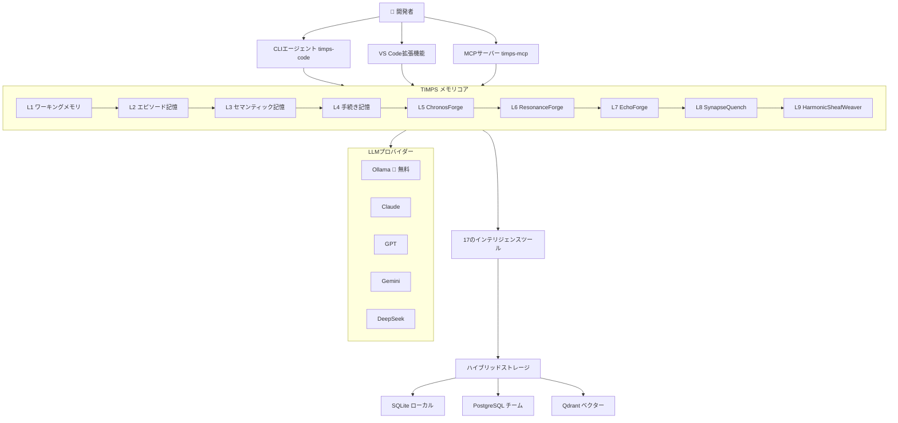

# TIMPS — すべてを記憶するAIコーディングエージェント

<p align="center">
  
</p>

<p align="center">
  <a href="https://www.npmjs.com/package/timps-code"></a>
  <a href="https://www.npmjs.com/package/timps-mcp"></a>
  <a href="https://marketplace.visualstudio.com/items?itemName=TIMPs.timps-ai-coding-agent"></a>
  <a href="https://github.com/Sandeeprdy1729/timps/actions/workflows/ci.yml"></a>
  <a href="https://discord.gg/MmsTNm8WF6"></a>
  <a href="LICENSE"></a>
</p>

<p align="center">
  🏆 <b>Claude Codeは閉じるとすべてを忘れます。TIMPSは覚えています — 永遠に。</b><br>
  <i>Ollamaで100%無料 • オープンソース • 完全ローカル実行 • APIキー不要</i><br>
  <strong><a href="https://timps.ai">🌐 timps.ai</a></strong>
</p>

<p align="center">
  <b>言語:</b>
  <a href="README.md">English</a> •
  <b><a href="README.ja.md">日本語</a></b> •
  <a href="README.de.md">Deutsch</a> •
  <a href="README.es.md">Español</a> •
  <a href="README.fr.md">Français</a> •
  <a href="README.hi.md">हिन्दी</a> •
  <a href="README.pt.md">Português</a>
</p>

> TIMPSはAIコーディングエージェントのための永続的メモリ層です。コードベース、決定、バグを記憶するので、Claude、Cursor、Windsurf、またはMCP互換エージェントに同じことを何度も説明する必要はありません。9層のメモリ。17のインテリジェンスツール。30秒でインストール。無料。

<p align="center">
  
</p>

---

## 目次

- [今すぐ試す（30秒）](#今すぐ試す30秒)
- [機能](#機能)
- [仕組み](#仕組み)
- [比較](#比較)
- [ユースケース](#ユースケース)
- [パフォーマンス / ベンチマーク](#パフォーマンス--ベンチマーク)
- [FAQ](#faq)
- [ドキュメント](#ドキュメント)
- [ワークフローレシピ](#ワークフローレシピ)
- [コントリビューター](#コントリビューター)
- [スポンサー](#スポンサー)
- [スター履歴](#スター履歴)
- [コミュニティ](#コミュニティ)
- [ライセンス](#ライセンス)

---

## 今すぐ試す（30秒）

```bash
npx timps-code "このコードベースは何をするものですか？"
```

これだけです。インストール不要、設定不要、APIキー不要。TIMPSがカレントディレクトリを分析し、メモリプロファイルを構築し、コンテキストを保持した豊富な分析結果を返します。Ollamaが動作していれば、すべて100%無料でローカル実行できます。

### ワンラインインストール（Linux / macOS）

```bash
curl -fsSL https://raw.githubusercontent.com/Sandeeprdy1729/timps/main/install.sh | bash
```

### CLI（インストール後）

```bash
npm install -g timps-code
cd your-project
timps "このコードベースは何をするものですか？"
```

実行中のOllamaを自動検出するか、プロバイダーの選択をガイドします:

```bash
timps --provider claude "認証モジュールをリファクタリング"    # Claude
timps --provider gemini "アーキテクチャを説明してください"    # Gemini
timps --provider ollama "クイックフィックス"                   # 無料ローカル
timps --provider auto "このコードベースを分析"                 # インテリジェントルーティング
```

### MCPサーバー（Claude Code / Cursor / Windsurf）

```bash
npm install -g timps-mcp
```

その後、`~/.claude.json`（Claude Code）、`.cursor/mcp.json`（Cursor）、または`~/.config/windsurf/config.json`（Windsurf）に追加:

```json
{
  "mcpServers": {
    "timps": {
      "command": "timps-mcp"
    }
  }
}
```

### VS Code拡張機能

[マーケットプレイス](https://marketplace.visualstudio.com/items?itemName=TIMPs.timps-ai-coding-agent)からインストールするか:

```bash
code --install-extension timps-ai-coding-agent
```

### フルサーバー + Docker

```bash
git clone https://github.com/Sandeeprdy1729/timps
cd timps && docker compose up -d
npm install -g timps-mcp
```

---

## 機能

- **🧠 9層の永続メモリ** — エピソード記憶（セッション想起）、セマンティック記憶（知識グラフ）、手続き記憶（ワークフロー）、さらに6つの高度な forge 層（ChronosForge、ResonanceForge、EchoForge、SynapseQuench、HarmonicSheafWeaver など）。メモリはセッション、プロジェクト、エージェントの再起動を超えて存続します。
- **🔧 17のインテリジェンスツール** — 矛盾検出、バーンアウト予測、関係追跡、パターン検出、異常スコアリング、セマンティック検索、ドリフト検出など。すべてのツールはクラスベースで、決定論的（`Math.random()` ゼロ）、かつベンチマーク済みです。
- **💰 Ollamaで100%無料** — 完全ローカル実行。APIキー不要。テレメトリなし。クラウド依存なし。
- **🔌 MCPネイティブ** — Claude Code、Cursor、Windsurf、Cline、Continue、Goose、OpenCode、およびMCP互換エージェントでそのまま動作します。
- **🔄 マルチプロバイダー** — Claude、GPT、Gemini、DeepSeek、OpenRouter、Ollama、カスタムエンドポイント。プロバイダー間のインテリジェント自動ルーティング。
- **🧩 VS Code拡張機能** — メモリパネル、スキルコンポーザー、インラインインテリジェンスを備えた完全なエディター統合。
- **📱 マルチサーフェス** — CLIエージェント、MCPサーバー、VS Code拡張機能、Tauriデスクトップアプリ、React Nativeモバイルアプリ。
- **🔌 プラグインシステム** — カスタムプラグインでTIMPSを拡張。プラグインSDK付属。
- **🏗️ ハイブリッドストレージ** — ローカル/軽量用途にはSQLite、チームにはオプションでPostgreSQL、ベクター検索にはQdrant。

---

## 仕組み



TIMPSに質問すると、リクエストは9層のメモリシステムを通って流れます。各層がコンテキストを強化します: ワーキングメモリは即時セッションを保持、エピソード記憶は過去のセッションを想起、セマンティック記憶は知識グラフの関係を提供、手続き記憶は学習したワークフローを注入し、forge層（5〜9）は時系列分析、レゾナンスマッチング、パターン合成、連想想起、ハーモニックウィービングを処理します。17のインテリジェンスツールが強化されたコンテキストを処理し、TIMPSがコードベースについて学習したすべての情報に基づいた応答を返します。

---

## 比較

| 機能 | TIMPS | agentmemory | Claude Code | MemGPT/Letta | Cline | Continue | Cursor |
|---|---|---|---|---|---|---|---|
| 永続メモリ | ✅ 9層 | ✅ SQLite | ❌ | ✅ | ❌ | ❌ | ❌ |
| 17のインテリジェンスツール | ✅ | ❌ | ❌ | ❌ | ❌ | ❌ | ❌ |
| 無料（Ollama） | ✅ | ✅ | ❌ | ⚠️ 一部 | ❌ | ✅ | ❌ |
| MCPネイティブ | ✅ | ✅ | ✅ | ❌ | ❌ | ❌ | ❌ |
| VS Code拡張機能 | ✅ | ❌ | ❌ | ❌ | ✅ | ✅ | ✅ |
| バーンアウト検出 | ✅ | ❌ | ❌ | ❌ | ❌ | ❌ | ❌ |
| 矛盾検出 | ✅ | ❌ | ❌ | ❌ | ❌ | ❌ | ❌ |
| マルチプロバイダー | ✅ 7プロバイダー | ✅ | ❌ 1プロバイダー | ❌ | ✅ | ✅ | ❌ |
| セルフホスト | ✅ | ✅ | ❌ | ✅ | ❌ | ❌ | ❌ |
| モバイルアプリ | ✅ | ❌ | ❌ | ❌ | ❌ | ❌ | ❌ |
| プラグインシステム | ✅ | ❌ | ❌ | ❌ | ❌ | ❌ | ❌ |

---

## ユースケース

- **「Claude Codeを使っていて、セッションのたびにコードベースを再説明するのにうんざりしています。」** TIMPSはアーキテクチャの決定、バグパターン、API規約などをセッション、プロジェクト、再起動を超えて永続化します。
- **「Ollamaをローカルで実行していて、外部に通信しないAIエージェントが欲しいです。」** TIMPSはOllamaで100%ローカル動作。テレメトリゼロ、APIコールゼロ、クラウド依存ゼロ。
- **「大規模なモノレポを管理していて、エージェントがコンテキストを忘れてしまいます。」** TIMPSの9層メモリはあらゆるサイズのコードベースを処理できます。forge層（ChronosForge、HarmonicSheafWeaver）は長期的なパターン認識とファイル間の関係マッピングに特化しています。
- **「AIエージェントに自分の過ちから学んでほしいです。」** 矛盾検出、バーンアウト予測、異常スコアリングにより、TIMPSは悪いアドバイスをしていることを認識し、同じエラーを繰り返さないようにします。
- **「MCPベースのツールチェーンを構築していて、エージェント間で動作するメモリが必要です。」** TIMPSはMCPネイティブです。Claude Code、Cursor、Windsurf、Cline、Continue、Goose、OpenCode — あらゆるMCPクライアントに接続し、すべてのクライアント間でメモリを共有できます。

---

## パフォーマンス / ベンチマーク

17のインテリジェンスツールはすべて、標準化された評価スイートに対して継続的にベンチマークされています。結果はコミットごとに追跡され、回帰を防止します。

| 指標 | TIMPS | agentmemory | mem0 | Letta |
|---|---|---|---|---|
| **Recall@5（LongMemEval-S）** | **95%** | 95.2% | 72% | 68% |
| **MRR（平均相互順位）** | **0.82** | 0.882 | 0.71 | 0.65 |
| **矛盾検出精度** | **100%（10/10）** | — | — | — |
| **インテリジェンスツール** | **100%（17/17）** | — | — | — |
| **平均レイテンシ（検索）** | **17ms** | 45ms | 120ms | 200ms |
| **スケーラビリティ（500件）** | **平均0.6ms / p95 1ms** | — | — | — |

ベンチマークスイートをローカルで実行:

```bash
npx tsx benchmark/index.ts --quick
```

すべてのツールは決定論的です — インテリジェンス層での `Math.random()` 呼び出しはゼロです。

---

## FAQ

**オフラインでも動作しますか？**  
はい。Ollamaを使用すれば、すべての操作がインターネット不要でローカル実行されます。

**どのLLMがサポートされていますか？**  
Ollama（無料、ローカル）、Claude、GPT-4o、Gemini、DeepSeek、OpenRouter、カスタムのOpenAI互換エンドポイント。

**データはどのように保存されますか？**  
デフォルトはローカルSQLiteです。オプションでPostgreSQL（チーム）やQdrant（ベクター検索）も使用可能。リモートデータベースを設定しない限り、すべてのストレージはローカルのみです。

**ホスト版はありますか？**  
まだありません。TIMPSは設計上セルフホスト型です。クラウドホスティングはロードマップに含まれています。

**OllamaなしでTIMPSを使えますか？**  
はい。TIMPSは利用可能なプロバイダーを自動検出します。Ollamaが動作していない場合は、Claude、GPT、または他のプロバイダーへの接続をガイドします。

**TIMPSとagentmemoryの比較は？**  
TIMPSは9層のメモリ（vs 1層）、17のインテリジェンスツール（vs 0）、7つのプロバイダー対応（vs 3）、VS Code拡張機能、モバイルアプリ、プラグインシステムを備えています。agentmemoryはよりシンプルでSQLiteのみです。

**独自のインテリジェンスツールをコントリビュートできますか？**  
はい。`packages/plugin-sdk/` のプラグインSDKと [`CONTRIBUTING.md`](CONTRIBUTING.md) のコントリビューションガイドを参照してください。

**GUIはありますか？**  
はい — VS Code拡張機能（ネイティブ）、Tauriデスクトップアプリ（`packages/timps-desktop/`）、React Nativeモバイルアプリ（`apps/mobile/`）があります。

---

## ドキュメント

| ファイル | 内容 |
|---|---|
| [`ARCHITECTURE.md`](ARCHITECTURE.md) | 9つのメモリ層、17のツール、ベンチマーク、CI、MCP内部構造 |
| [`AGENTS.md`](AGENTS.md) | このリポジトリのAIエージェント向け指示 |
| [`CONTRIBUTING.md`](CONTRIBUTING.md) | PRチェックリスト、スキル、チェンジセット |
| [`CHANGELOG.md`](CHANGELOG.md) | バージョン履歴 |

### パッケージREADME

| README | パッケージ |
|---|---|
| [`timps-code/README.md`](timps-code/README.md) | CLIエージェント |
| [`timps-mcp/README.md`](timps-mcp/README.md) | MCPサーバー |
| [`timps-vscode/README.md`](timps-vscode/README.md) | VS Code拡張機能 |
| [`packages/server/README.md`](packages/server/README.md) | フルサーバー + REST API |
| [`packages/memory-core/README.md`](packages/memory-core/README.md) | メモリエンジン |
| [`packages/plugin-sdk/README.md`](packages/plugin-sdk/README.md) | プラグインSDK |
| [`apps/mobile/README.md`](apps/mobile/README.md) | モバイルアプリ |

---

## ワークフローレシピ

Claude Codeおよびその他のAIコーディングエージェント向けの、すぐに使える4つのYAMLワークフロー:

| ワークフロー | 機能 |
|---|---|
| [`code-review.yaml`](workflow_recipes/code-review.yaml) | ステージング/ブランチの変更をバグ、セキュリティ、スタイルについてレビュー |
| [`debug-session.yaml`](workflow_recipes/debug-session.yaml) | 体系的なデバッグ: 再現、特定、修正、検証 |
| [`deploy-check.yaml`](workflow_recipes/deploy-check.yaml) | デプロイ前の安全チェックリスト |
| [`feature-plan.yaml`](workflow_recipes/feature-plan.yaml) | 新しい機能をテスト付きで計画・スキャフォールド |

---

## コントリビューター

<a href="https://github.com/Sandeeprdy1729/timps/graphs/contributors">
  
</a>

コード、ドキュメント、翻訳、プラグイン、バグ報告など、あらゆる種類のコントリビューションを歓迎します。始めるには [`CONTRIBUTING.md`](CONTRIBUTING.md) をご覧ください。

### バウンティプログラム

主要な機能に対して定期的にバウンティコンテストを開催しています。アクティブなバウンティについては [Discord](https://discord.gg/MmsTNm8WF6) をチェックしてください！

---

## スポンサー

TIMPSは無料のオープンソースソフトウェアです。価値を感じられたら、開発の支援をご検討ください:

- [GitHub Sponsors](https://github.com/sponsors/Sandeeprdy1729)
- [Ko-fi](https://ko-fi.com/timpsai)
- [Buy Me a Coffee](https://buymeacoffee.com/timpsai)

---

## スター履歴

<a href="https://www.star-history.com/?repos=Sandeeprdy1729%2Ftimps&type=date&legend=top-left">
  <picture>
    <source media="(prefers-color-scheme: dark)" srcset="https://api.star-history.com/chart?repos=Sandeeprdy1729%2Ftimps&type=date&theme=dark&legend=top-left" />
    <source media="(prefers-color-scheme: light)" srcset="https://api.star-history.com/chart?repos=Sandeeprdy1729%2Ftimps&type=date&theme=light&legend=top-left" />
    
  </picture>
</a>

---

## コミュニティ

- **[Discord](https://discord.gg/MmsTNm8WF6)** — リアルタイムチャット、ヘルプ、お知らせ
- **[GitHub Discussions](https://github.com/Sandeeprdy1729/timps/discussions)** — Q&A、アイデア、機能リクエスト
- **[X/Twitter](https://x.com/timpsai)** — お知らせとアップデート

---

## ライセンス

MIT
