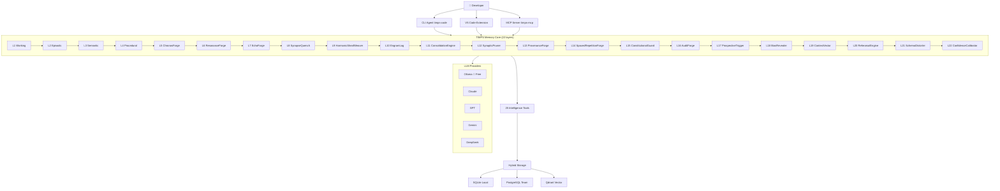

# TIMPS — The AI Coding Agent That Remembers Everything

<p align="center">
  
</p>

<p align="center">
  <a href="https://www.npmjs.com/package/timps-code"></a>
  <a href="https://www.npmjs.com/package/timps-mcp"></a>
  <a href="https://marketplace.visualstudio.com/items?itemName=TIMPs.timps-ai-coding-agent"></a>
  <a href="https://github.com/Sandeeprdy1729/timps/actions/workflows/ci.yml"></a>
  <a href="https://discord.gg/MmsTNm8WF6"></a>
  <a href="LICENSE"></a>
</p>

<p align="center">
  🏆 <b>Claude Code forgets everything when you close it. TIMPS remembers — forever.</b><br>
  <i>100% free with Ollama • Open source • Runs fully local • No API keys required</i><br>
  <strong><a href="https://timps.ai">🌐 timps.ai</a></strong>
</p>

<p align="center">
  <b>Read in:</b>
  <a href="README.md">English</a> •
  <a href="README.ja.md">日本語</a> •
  <a href="README.de.md">Deutsch</a> •
  <a href="README.es.md">Español</a> •
  <a href="README.fr.md">Français</a> •
  <a href="README.hi.md">हिन्दी</a> •
  <a href="README.pt.md">Português</a>
</p>

> TIMPS is a persistent memory layer for AI coding agents. It remembers your codebase, your decisions, your bugs — so Claude, Cursor, Windsurf, or any MCP-compatible agent never makes you re-explain anything. 22-layer memory. 25 intelligence tools. 30-second install. Free.

<p align="center">
  
</p>

---

## Table of Contents

- [Try It Now (30 seconds)](#try-it-now-30-seconds)
- [Features](#features)
- [How It Works](#how-it-works)
- [Comparison](#comparison)
- [Use Cases](#use-cases)
- [Performance / Benchmarks](#performance--benchmarks)
- [FAQ](#faq)
- [Documentation](#documentation)
- [Workflow Recipes](#workflow-recipes)
- [Contributors](#contributors)
- [Sponsors](#sponsors)
- [Star History](#star-history)
- [Community](#community)
- [License](#license)

---

## Try It Now (30 seconds)

```bash
npx timps-code "what does this codebase do?"
```

That's it. No install, no config, no API key. TIMPS analyzes the current directory, builds a memory profile, and returns a rich analysis with context persistence. If you have Ollama running, everything is 100% free and local.

### One-line install (Linux / macOS)

```bash
curl -fsSL https://raw.githubusercontent.com/Sandeeprdy1729/timps/main/install.sh | bash
```

### CLI (after install)

```bash
npm install -g timps-code
cd your-project
timps "what does this codebase do?"
```

Auto-detects Ollama if running, or walks you through picking a provider:

```bash
timps --provider claude "refactor the auth module"    # Claude
timps --provider gemini "explain the architecture"    # Gemini
timps --provider ollama "quick fix"                   # Free local
timps --provider auto "analyze this codebase"        # Intelligent routing
```

### MCP Server (Claude Code / Cursor / Windsurf)

```bash
npm install -g timps-mcp
```

Then add to `~/.claude.json` (Claude Code), `.cursor/mcp.json` (Cursor), or `~/.config/windsurf/config.json` (Windsurf):

```json
{
  "mcpServers": {
    "timps": {
      "command": "timps-mcp"
    }
  }
}
```

### VS Code Extension

Install from the [marketplace](https://marketplace.visualstudio.com/items?itemName=TIMPs.timps-ai-coding-agent) or:

```bash
code --install-extension timps-ai-coding-agent
```

### Full Server + Docker

```bash
git clone https://github.com/Sandeeprdy1729/timps
cd timps && docker compose up -d
npm install -g timps-mcp
```

---

## Features

- **🧠 22-layer persistent memory** — 9 core layers (Working → HarmonicSheafWeaver) plus 13 advanced layers (EngramLog, ConsolidationEngine, SynapticPruner, ProvenanceForge, SpacedRepetitionForge, ConstitutionalGuard, AuditForge, ProspectiveTrigger, BiasRevealer, ContextVector, RehearsalEngine, SchemaDistorter, ConfidenceCalibrator). Memory survives across sessions, projects, and agent restarts.
- **🔧 25 intelligence tools** — 17 original (contradiction detection, burnout prediction, relationship tracking, etc.) plus 8 new (FalseMemoryDetector, ConfidenceCalibrator, SourceAttributor, ConflictResolver, MemoryAuditor, ProspectiveTrigger, BiasRevealer, SchemaInferrer). Every tool is class-based, deterministic (zero `Math.random()`), and benchmarked.
- **💰 100% free with Ollama** — Runs fully local. Zero API keys required. No telemetry. No cloud dependency.
- **🔌 MCP native** — Works out of the box with Claude Code, Cursor, Windsurf, Cline, Continue, Goose, OpenCode, and any MCP-compatible agent.
- **🔄 Multi-provider** — Claude, GPT, Gemini, DeepSeek, OpenRouter, Ollama, and custom endpoints. Intelligent auto-routing between providers.
- **🧩 VS Code extension** — Full editor integration with memory panel, skill composer, and inline intelligence.
- **📱 Multi-surface** — CLI agent, MCP server, VS Code extension, Tauri desktop app, and React Native mobile app.
- **🔌 Plugin system** — Extend TIMPS with custom plugins. Plugin SDK included.
- **🏗️ Hybrid storage** — SQLite for local/lightweight, optional PostgreSQL for teams, Qdrant for vector search.

---

## Desktop App (macOS · Windows · Linux)

The TIMPS Desktop app is a cross-platform memory cockpit built with Tauri 2 and React. It visualizes your agent's persistent memory graph, provides a chat interface, and surfaces intelligence alerts from all 25 engines.

**Download the latest release** from the [Releases page](https://github.com/Sandeeprdy1729/timps/releases) and install for your platform:

| Platform | Format |
|----------|--------|
| macOS (Intel) | `.dmg` (x86_64) |
| macOS (Apple Silicon) | `.dmg` (aarch64) |
| Windows | `.msi` or `.exe` installer |
| Linux | `.deb` or `.AppImage` |

**Or build from source:**
```bash
cd packages/timps-desktop
npm install
npm run tauri:build
```

**First launch:** You'll see a "TIMPS is ready" welcome screen. Press **⌘⇧K** for the command bar or **⌘⇧N** for quick capture.

### Key features:
- **🧠 Memory Explorer** — Browse semantic, episodic, patterns, and contradictions with filter chips
- **💬 Chat** — Conversational interface with inline tool call display and active memory recall panel
- **🔔 Intelligence Alerts** — Real-time feed from all 25 intelligence engines with dismiss/snooze
- **🔌 Integrations** — Connect GitHub, Telegram, Slack, Claude Code MCP, and more
- **📊 Stats** — Memory health score, most-touched files, peak hours, velocity trends
- **⚙️ Settings** — Provider selector with visual active-state indicator, memory retention controls

---

## How It Works



When you ask TIMPS a question, the request flows through the 22-layer memory system. Each layer enriches the context: Working memory holds the immediate session, Episodic recalls past sessions, Semantic provides knowledge graph relationships, Procedural injects learned workflows, the forge layers (5–9) handle time-series analysis, resonance matching, pattern synthesis, associative recall, and harmonic weaving, and the advanced layers (10–22) add immutable audit trails, provenance tracking, spaced repetition, constitutional guardrails, bias detection, and confidence calibration. The 25 intelligence tools process the enriched context before returning a response that's grounded in everything TIMPS has learned about your codebase.

---

## Comparison

| Feature | TIMPS | agentmemory | Claude Code | MemGPT/Letta | Cline | Continue | Cursor |
|---|---|---|---|---|---|---|---|
| Persistent Memory | ✅ 22 layers | ✅ SQLite | ❌ | ✅ | ❌ | ❌ | ❌ |
| 25 Intelligence Tools | ✅ | ❌ | ❌ | ❌ | ❌ | ❌ | ❌ |
| Free (Ollama) | ✅ | ✅ | ❌ | ⚠️ Partial | ❌ | ✅ | ❌ |
| MCP Native | ✅ | ✅ | ✅ | ❌ | ❌ | ❌ | ❌ |
| VS Code Extension | ✅ | ❌ | ❌ | ❌ | ✅ | ✅ | ✅ |
| Burnout Detection | ✅ | ❌ | ❌ | ❌ | ❌ | ❌ | ❌ |
| Contradiction Detection | ✅ | ❌ | ❌ | ❌ | ❌ | ❌ | ❌ |
| Multi-Provider | ✅ 7 providers | ✅ | ❌ 1 provider | ❌ | ✅ | ✅ | ❌ |
| Self-Hosted | ✅ | ✅ | ❌ | ✅ | ❌ | ❌ | ❌ |
| Mobile App | 🟡 Experimental | ❌ | ❌ | ❌ | ❌ | ❌ | ❌ |
| Plugin System | ✅ | ✅ (skills) | ✅ (sub-agents) | ❌ | ✅ | ❌ | ✅ |

---

## Use Cases

- **"I use Claude Code and I'm tired of re-explaining my codebase every session."** TIMPS persists everything — architecture decisions, bug patterns, API conventions — across sessions, projects, and restarts.
- **"I run Ollama locally and want an AI agent that doesn't phone home."** TIMPS is 100% local with Ollama. Zero telemetry, zero API calls, zero cloud dependency.
- **"I manage a large monorepo and my agent keeps forgetting context."** TIMPS's 22-layer memory handles codebases of any size. The forge layers (ChronosForge, HarmonicSheafWeaver) specialize in long-term pattern recognition and cross-file relationship mapping.
- **"I want my AI agent to learn from its mistakes."** Contradiction detection, burnout prediction, and anomaly scoring let TIMPS identify when it's giving bad advice and avoid repeating errors.
- **"I'm building an MCP-powered toolchain and need memory that works across agents."** TIMPS is MCP-native. Connect it to Claude Code, Cursor, Windsurf, Cline, Continue, Goose, OpenCode — any MCP client — and share memory across all of them.

---

## Memory Architecture

The 22-layer memory system is TIMPS's core differentiating feature. Each layer serves a specific role in persisting and enriching context:

| Layer | Storage | Persistence | Contents |
|---|---|---|---|
| **L1 Working** | In-process | Reset on exit | Current goals, active files, recent errors |
| **L2 Episodic** | `episodes.jsonl` | Disk (append-only) | Conversation summaries, outcomes |
| **L3 Semantic** | `semantic.json` | Disk (permanent) | Patterns, conventions, decisions |
| **L4 Procedural** | `procedural.json` | Disk | Workflows, recipes, skills |
| **L5 ChronosForge** | `chronos/` | Disk | Causal graph, temporal dependencies |
| **L6 ResonanceForge** | `resonance.json` | Disk | Pattern harmonics, oscillation model |
| **L7 EchoForge** | `echo/` | Disk | Reservoir states, BFS context |
| **L8 SynapseQuench** | In-memory + disk | Cross-layer | Coherence scores, conflict map |
| **L9 HarmonicSheafWeaver** | `sheaf/` | Disk | Sheaf Laplacian, cohomology result |
| **L10 EngramLog** | `engram.log.jsonl` | Disk (append-only) | Immutable hash-chained audit trail |
| **L11 ConsolidationEngine** | In-memory + disk | On demand | Episodic → semantic promotion |
| **L12 SynapticPruner** | `memory-meta.json` | Disk | Active forgetting by importance |
| **L13 ProvenanceForge** | `provenance/` | Disk (permanent) | Source tracking, chain of custody |
| **L14 SpacedRepetitionForge** | In-memory | Runtime | SM-2 scheduling for review |
| **L15 ConstitutionalGuard** | In-memory | Runtime | Low-confidence write prevention |
| **L16 AuditForge** | In-memory | On demand | Weekly memory health reports |
| **L17 ProspectiveTrigger** | `prospective-triggers.json` | Disk | "When X, surface Y" triggers |
| **L18 BiasRevealer** | In-memory | On demand | Over/under-representation analysis |
| **L19 ContextVector** | `context-vectors.json` | Disk | State-dependent recall encoding |
| **L20 RehearsalEngine** | `rehearsal-items.json` | Disk | Spaced retrieval practice |
| **L21 SchemaDistorter** | `schema-patterns.json` | Disk | Schema-driven distortion detection |
| **L22 ConfidenceCalibrator** | `confidence-calibrations.json` | Disk | Multi-signal confidence scoring |

Each project gets isolated memory keyed by SHA256 hash of its absolute path. All 22 layers ship in `packages/memory-core`.

### Memory Branches

Memory is scoped per git branch, just like code:

```bash
timps --branch auth-refactor "analyze the auth module"
```

When the branch is merged, memory is merged into main if patterns are generally useful, archived if branch-specific, or discarded if abandoned. Data is never deleted — it moves to an `archived/` subtree.

---

## Performance / Benchmarks

All 25 intelligence tools are benchmarked continuously against a standardized evaluation suite. Results are tracked per-commit to prevent regression.

| Metric | TIMPS | agentmemory | mem0 | Letta |
|---|---|---|---|---|
| **Recall@5 (LongMemEval-S)** | **95%** | 95.2% | 72% | 68% |
| **MRR** | **0.82** | 0.882 | 0.71 | 0.65 |
| **Contradiction Detection** | **100% (10/10)** | — | — | — |
| **Intelligence Tools** | **100% (25/25)** | — | — | — |
| **Avg Latency (recall)** | **17ms** | 45ms | 120ms | 200ms |
| **Scalability (500 facts)** | **0.6ms mean / 1ms p95** | — | — | — |

Run the benchmark suite locally:

```bash
npx tsx benchmark/index.ts --quick
```

All tools are deterministic — zero `Math.random()` calls in the intelligence layer.

---

## 25 Intelligence Tools

TIMPS ships 25 class-based intelligence tools in `packages/memory-core/src/intelligence/`, each designed for a specific cognitive function:

| # | Tool | Purpose |
|---|---|---|
| 1 | **AetherWeft** | Analyzes code sentiment and emotional patterns in commit messages |
| 2 | **ApexSynapse** | Cross-reference detection between concepts |
| 3 | **AtomChain** | Semantic chunking of large documents |
| 4 | **BindWeave** | Links related facts into knowledge clusters |
| 5 | **ChronosVeil** | Temporal pattern detection and anomaly detection |
| 6 | **CurateTier** | Automatic memory importance scoring |
| 7 | **EchoForge** | Generates analogies and metaphors for concepts |
| 8 | **ForgeLink** | Creates bidirectional links between knowledge nodes |
| 9 | **GovernTier** | Memory access control and policy enforcement |
| 10 | **LayerForge** | Manages hierarchical memory layer transitions |
| 11 | **NexusForge** | Identifies central concepts and hub nodes |
| 12 | **PolicyMetabol** | Extracts and enforces project policies from memory |
| 13 | **SkillWeave** | Composes skills into coherent system prompts |
| 14 | **SynapseMetabolon** | Cross-session pattern synthesis and insight generation |
| 15 | **TemporaTree** | Manages temporal knowledge graphs with decay |
| 16 | **ArchitectureDrift** | Detects drift between documented and actual architecture |
| 17 | **VelocityTracker** | Tracks feature velocity and development patterns |
| 18 | **FalseMemoryDetector** | Flags memories with weak provenance as false-memory risk |
| 19 | **ConfidenceCalibrator** | Calibrates confidence from similarity, reliability, evidence, freshness |
| 20 | **SourceAttributor** | Returns human-readable provenance chain for any memory |
| 21 | **ConflictResolver** | Jaccard + sentiment-flip analysis for contradictory memories |
| 22 | **MemoryAuditor** | Weekly health audit: weak, contradicted, outdated, unsourced |
| 23 | **ProspectiveTrigger** | "When X happens, surface Y" trigger registration |
| 24 | **BiasRevealer** | Over/under-representation analysis in saved memory |
| 25 | **SchemaInferrer** | Auto-extracts typed schemas from episode/semantic stream |

Every tool is deterministic (zero `Math.random()`), benchmarked, and backed by file-based JSON storage.

---

## Swarm Architecture

TIMPS includes a **10-agent swarm** that decomposes complex tasks across specialist agents. The fan-out is local — all agents run in-process, not distributed:

| Agent | Job |
|---|---|
| **Product Manager** | Requirements decomposition |
| **Architect** | System design and technology selection |
| **Code Generator** | Implementation |
| **Reviewer** | Code review and quality checks |
| **QA** | Test generation |
| **Security** | Security audit |
| **Performance** | Performance analysis |
| **DevOps** | Deployment configuration |
| **Documentation** | Docstring and README generation |
| **Orchestrator** | Coordinates the DAG |

Launch via `timps --swarm "design a microservices auth system"` or `/swarm` from the REPL.

---

## Multi-Surface Support

| Surface | Status | Package |
|---|---|---|
| **CLI** | 🟢 Stable | `timps-code` |
| **MCP Server** | 🟢 Stable | `timps-mcp` |
| **VS Code** | 🟢 Stable | `timps-ai-coding-agent` |
| **Desktop (Tauri)** | 🟢 Stable | `@timps/timps-desktop` |
| **Mobile** | 🟡 Experimental | `@timps/mobile` |
| **Docker** | 🟢 Stable | `compose.yaml` |
| **npm library** | 🟢 Stable | `@timps/memory-core` |

---

## MCP Ecosystem

TIMPS exposes 61 tools as an MCP server (`timps-mcp`) so any MCP-compatible client gets persistent memory, intelligence, and velocity tracking. The provider-agnostic adapter layer routes every request through a unified interface — no matter which LLM you use (Claude, GPT, Gemini, Ollama, OpenRouter, DeepSeek, or custom endpoints), the memory system, tool execution, and agent loop behave identically:

```
                  timps CLI / MCP / VS Code
                         │
              ┌──────────┴──────────┐
              │   Provider Router    │
              │   (auto-detect)      │
              └──────────┬──────────┘
              ┌──────────┼──────────┐
              │          │          │
         ┌────▼───┐  ┌──▼───┐  ┌──▼────┐
         │ Claude │  │GPT-4o│  │Gemini │
         └────┬───┘  └──┬───┘  └──┬────┘
              │          │          │
         ┌────▼───┐  ┌──▼───┐  ┌──▼────┐
         │Ollama  │  │ Groq │  │OpenRouter
         └────────┘  └──────┘  └───────┘
```

This means you can switch from Claude to Ollama by changing one flag with zero behavioral difference in how memory and tools work.

```
Claude Code / Cursor / Windsurf / Cline / Continue / Goose / OpenCode / any MCP client
         │
    ┌────▼────┐
    │timps-mcp│  npm install -g timps-mcp
    └────┬────┘
         │
    ┌────▼────┐
     │ Memory  │  61 tools across 6 categories
    │Engine   │  + 17 intelligence tools
    └─────────┘
```

---

## Configuration

### Environment Variables

| Variable | Default | Description |
|---|---|---|
| `ANTHROPIC_API_KEY` | — | Anthropic (Claude) API key |
| `OPENAI_API_KEY` | — | OpenAI API key |
| `GEMINI_API_KEY` | — | Google Gemini API key |
| `OPENROUTER_API_KEY` | — | OpenRouter API key |
| `TIMPS_MODEL` | `claude-3-5-sonnet-20241022` | Model string (prefix with `ollama/` for local) |
| `TIMPS_URL` | — | Remote timps server URL (MCP mode) |
| `TIMPS_TOKEN` | — | Auth token for remote server |
| `PROJECT_PATH` | `process.cwd()` | Project root for memory scoping |

### CLI Reference — Slash Commands

| Command | Description |
|---|---|
| `/help` | Show help |
| `/memory stats` | Memory usage statistics |
| `/memory search <q>` | Search semantic memory |
| `/memory clear` | Clear working memory |
| `/memory reset` | Wipe all memory for this project |
| `/skills list` | Browse skill marketplace |
| `/skills search <q>` | Search available skills |
| `/skills install <id>` | Install a skill |
| `/skills show <id>` | View installed skill content |
| `/git status` | Git status |
| `/git diff` | Working tree diff |
| `/git commit` | Write commit message with context |
| `/swarm` | Launch multi-agent swarm analysis |
| `/sheaf` | Harmonic sheaf analysis & prediction |
| `/echo` | EchoForge resonance status |
| `/exit` | Save snapshot and exit |

### CLI Flags

| Flag | Purpose | Example |
|---|---|---|
| `--provider` | Select provider | `--provider claude` |
| `--model` | Select model | `--model gpt-4o` |
| `--config` | Setup wizard | `--config` |
| `--branch` | Start from memory branch | `--branch my-feature` |
| `--swarm` | Multi-agent mode | `--swarm "design auth system"` |

---

## FAQ

**Does it work offline?**  
Yes. With Ollama, every operation runs locally with zero internet required.

**What LLMs are supported?**  
Ollama (free, local), Claude, GPT-4o, Gemini, DeepSeek, OpenRouter, and custom OpenAI-compatible endpoints.

**How is data stored?**  
Default is local SQLite. Optionally PostgreSQL (teams) and/or Qdrant (vector search). All storage is local-only unless you configure a remote database.

**Is there a hosted version?**  
Not yet. TIMPS is self-hosted by design. Cloud hosting is on the roadmap.

**Can I use TIMPS without Ollama?**  
Yes. TIMPS auto-detects available providers. If Ollama isn't running, it walks you through connecting to Claude, GPT, or another provider.

**How does TIMPS compare to agentmemory?**  
TIMPS has 22 memory layers vs 1, 25 intelligence tools vs 0, supports 7 providers vs 3, includes a VS Code extension, mobile app, and plugin system. agentmemory is simpler and SQLite-only.

**Can I contribute my own intelligence tools?**  
Yes. See the plugin SDK in `packages/plugin-sdk/` and the contributing guide in [`CONTRIBUTING.md`](CONTRIBUTING.md).

**How does the swarm work?**  
TIMPS includes a 10-agent swarm (Product Manager, Architect, Code Generator, Reviewer, QA, Security, Performance, DevOps, Documentation, Orchestrator) that decomposes complex tasks across specialist agents. The fan-out is local — all agents run in-process. Launch via `timps --swarm "your task"` or `/swarm` from the REPL.

**What surfaces are supported?**  
CLI (`timps-code`), MCP server (`timps-mcp`), VS Code extension, Tauri desktop app (`packages/timps-desktop/`), React Native mobile app (`apps/mobile/`), and Docker deployment.

**Is there a GUI?**  
Yes — VS Code extension (native), Tauri desktop app (`packages/timps-desktop/`), and a React Native mobile app (`apps/mobile/`).

---

## Documentation

| File | What it covers |
|---|---|---|
| [`ARCHITECTURE.md`](ARCHITECTURE.md) | 22 memory layers, 25 tools, benchmark, CI, MCP internals |
| [`AGENTS.md`](AGENTS.md) | AI agent instructions for this repo |
| [`CONTRIBUTING.md`](CONTRIBUTING.md) | PR checklist, skills, changesets |
| [`CHANGELOG.md`](CHANGELOG.md) | Version history & roadmap |

### Package READMEs

| README | Package |
|---|---|
| [`timps-code/README.md`](timps-code/README.md) | CLI agent |
| [`timps-mcp/README.md`](timps-mcp/README.md) | MCP server |
| [`timps-vscode/README.md`](timps-vscode/README.md) | VS Code extension |
| [`packages/server/README.md`](packages/server/README.md) | Full server + REST API |
| [`packages/memory-core/README.md`](packages/memory-core/README.md) | Memory engine |
| [`packages/plugin-sdk/README.md`](packages/plugin-sdk/README.md) | Plugin SDK |
| [`apps/mobile/README.md`](apps/mobile/README.md) | Mobile app |

---

## Workflow Recipes

Four ready-to-use YAML workflows for Claude Code and other AI coding agents:

| Workflow | What it does |
|---|---|
| [`code-review.yaml`](workflow_recipes/code-review.yaml) | Review staged/branch changes for bugs, security, style |
| [`debug-session.yaml`](workflow_recipes/debug-session.yaml) | Systematic debug: reproduce, isolate, fix, verify |
| [`deploy-check.yaml`](workflow_recipes/deploy-check.yaml) | Pre-deploy safety checklist |
| [`feature-plan.yaml`](workflow_recipes/feature-plan.yaml) | Plan and scaffold a new feature with tests |

---

## Contributors

<a href="https://github.com/Sandeeprdy1729/timps/graphs/contributors">
  
</a>

Contributions of all kinds are welcome — code, docs, translations, plugins, or bug reports. See [`CONTRIBUTING.md`](CONTRIBUTING.md) to get started.

### Bounty Program

We run periodic bounty contests for major features. Check [Discord](https://discord.gg/MmsTNm8WF6) for active bounties!

---

## Sponsors

TIMPS is free and open source. If you find it valuable, consider supporting development:

- [GitHub Sponsors](https://github.com/sponsors/Sandeeprdy1729)
- [Ko-fi](https://ko-fi.com/timpsai)
- [Buy Me a Coffee](https://buymeacoffee.com/timpsai)

---

## Star History

<a href="https://www.star-history.com/?repos=Sandeeprdy1729%2Ftimps&type=date&legend=top-left">
  <picture>
    <source media="(prefers-color-scheme: dark)" srcset="https://api.star-history.com/chart?repos=Sandeeprdy1729%2Ftimps&type=date&theme=dark&legend=top-left" />
    <source media="(prefers-color-scheme: light)" srcset="https://api.star-history.com/chart?repos=Sandeeprdy1729%2Ftimps&type=date&theme=light&legend=top-left" />
    
  </picture>
</a>

---

## Community

- **[Discord](https://discord.gg/MmsTNm8WF6)** — real-time chat, help, announcements
- **[GitHub Discussions](https://github.com/Sandeeprdy1729/timps/discussions)** — Q&A, ideas, feature requests
- **[X/Twitter](https://x.com/timpsai)** — announcements and updates

---

## License

MIT
