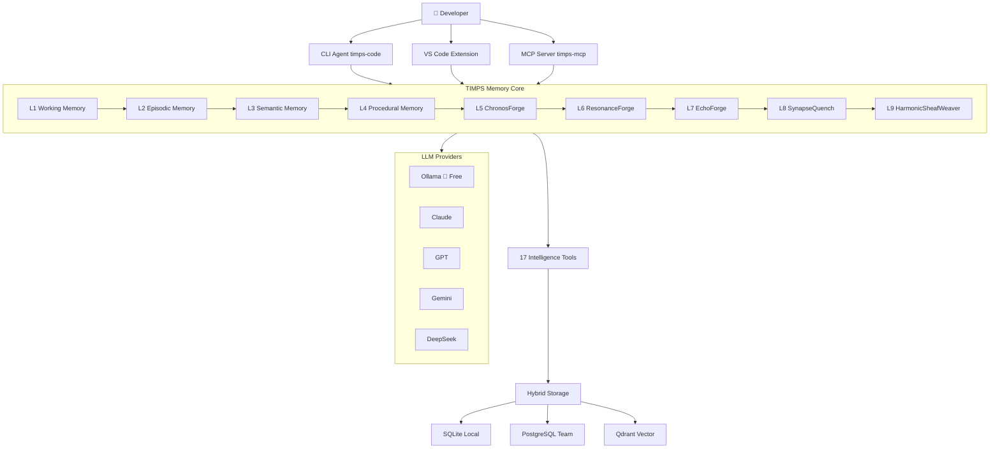

# TIMPS — The AI Coding Agent That Remembers Everything

<p align="center">
  
</p>

<p align="center">
  <a href="https://www.npmjs.com/package/timps-code"></a>
  <a href="https://www.npmjs.com/package/timps-mcp"></a>
  <a href="https://marketplace.visualstudio.com/items?itemName=TIMPs.timps-ai-coding-agent"></a>
  <a href="https://github.com/Sandeeprdy1729/timps/actions/workflows/ci.yml"></a>
  <a href="https://discord.gg/MmsTNm8WF6"></a>
  <a href="LICENSE"></a>
</p>

<p align="center">
  🏆 <b>Claude Code forgets everything when you close it. TIMPS remembers — forever.</b><br>
  <i>100% free with Ollama • Open source • Runs fully local • No API keys required</i>
</p>

<p align="center">
  <b>Read in:</b>
  <a href="README.md">English</a> •
  <a href="README.ja.md">日本語</a> •
  <a href="README.de.md">Deutsch</a> •
  <a href="README.es.md">Español</a> •
  <a href="README.fr.md">Français</a> •
  <a href="README.hi.md">हिन्दी</a> •
  <a href="README.pt.md">Português</a>
</p>

> TIMPS is a persistent memory layer for AI coding agents. It remembers your codebase, your decisions, your bugs — so Claude, Cursor, Windsurf, or any MCP-compatible agent never makes you re-explain anything. 9-layer memory. 17 intelligence tools. 30-second install. Free.

<p align="center">
  
</p>

---

## Table of Contents

- [Try It Now (30 seconds)](#try-it-now-30-seconds)
- [Features](#features)
- [How It Works](#how-it-works)
- [Comparison](#comparison)
- [Use Cases](#use-cases)
- [Performance / Benchmarks](#performance--benchmarks)
- [FAQ](#faq)
- [Documentation](#documentation)
- [Workflow Recipes](#workflow-recipes)
- [Contributors](#contributors)
- [Sponsors](#sponsors)
- [Star History](#star-history)
- [Community](#community)
- [License](#license)

---

## Try It Now (30 seconds)

```bash
npx timps-code "what does this codebase do?"
```

That's it. No install, no config, no API key. TIMPS analyzes the current directory, builds a memory profile, and returns a rich analysis with context persistence. If you have Ollama running, everything is 100% free and local.

### One-line install (Linux / macOS)

```bash
curl -fsSL https://raw.githubusercontent.com/Sandeeprdy1729/timps/main/install.sh | bash
```

### CLI (after install)

```bash
npm install -g timps-code
cd your-project
timps "what does this codebase do?"
```

Auto-detects Ollama if running, or walks you through picking a provider:

```bash
timps --provider claude "refactor the auth module"    # Claude
timps --provider gemini "explain the architecture"    # Gemini
timps --provider ollama "quick fix"                   # Free local
timps --provider auto "analyze this codebase"        # Intelligent routing
```

### MCP Server (Claude Code / Cursor / Windsurf)

```bash
npm install -g timps-mcp
```

Then add to `~/.claude.json` (Claude Code), `.cursor/mcp.json` (Cursor), or `~/.config/windsurf/config.json` (Windsurf):

```json
{
  "mcpServers": {
    "timps": {
      "command": "timps-mcp"
    }
  }
}
```

### VS Code Extension

Install from the [marketplace](https://marketplace.visualstudio.com/items?itemName=TIMPs.timps-ai-coding-agent) or:

```bash
code --install-extension timps-ai-coding-agent
```

### Full Server + Docker

```bash
git clone https://github.com/Sandeeprdy1729/timps
cd timps && docker compose up -d
npm install -g timps-mcp
```

---

## Features

- **🧠 9-layer persistent memory** — Episodic (session recall), Semantic (knowledge graph), Procedural (workflows), plus 6 advanced forge layers (ChronosForge, ResonanceForge, EchoForge, SynapseQuench, HarmonicSheafWeaver, and more). Memory survives across sessions, projects, and agent restarts.
- **🔧 17 intelligence tools** — Contradiction detection, burnout prediction, relationship tracking, pattern detection, anomaly scoring, semantic search, drift detection, and more. Every tool is class-based, deterministic (zero `Math.random()`), and benchmarked.
- **💰 100% free with Ollama** — Runs fully local. Zero API keys required. No telemetry. No cloud dependency.
- **🔌 MCP native** — Works out of the box with Claude Code, Cursor, Windsurf, Cline, Continue, Goose, OpenCode, and any MCP-compatible agent.
- **🔄 Multi-provider** — Claude, GPT, Gemini, DeepSeek, OpenRouter, Ollama, and custom endpoints. Intelligent auto-routing between providers.
- **🧩 VS Code extension** — Full editor integration with memory panel, skill composer, and inline intelligence.
- **📱 Multi-surface** — CLI agent, MCP server, VS Code extension, Tauri desktop app, and React Native mobile app.
- **🔌 Plugin system** — Extend TIMPS with custom plugins. Plugin SDK included.
- **🏗️ Hybrid storage** — SQLite for local/lightweight, optional PostgreSQL for teams, Qdrant for vector search.

---

## How It Works



When you ask TIMPS a question, the request flows through the 9-layer memory system. Each layer enriches the context: Working memory holds the immediate session, Episodic recalls past sessions, Semantic provides knowledge graph relationships, Procedural injects learned workflows, and the forge layers (5–9) handle time-series analysis, resonance matching, pattern synthesis, associative recall, and harmonic weaving. The 17 intelligence tools process the enriched context before returning a response that's grounded in everything TIMPS has learned about your codebase.

---

## Comparison

| Feature | TIMPS | agentmemory | Claude Code | MemGPT/Letta | Cline | Continue | Cursor |
|---|---|---|---|---|---|---|---|
| Persistent Memory | ✅ 9 layers | ✅ SQLite | ❌ | ✅ | ❌ | ❌ | ❌ |
| 17 Intelligence Tools | ✅ | ❌ | ❌ | ❌ | ❌ | ❌ | ❌ |
| Free (Ollama) | ✅ | ✅ | ❌ | ⚠️ Partial | ❌ | ✅ | ❌ |
| MCP Native | ✅ | ✅ | ✅ | ❌ | ❌ | ❌ | ❌ |
| VS Code Extension | ✅ | ❌ | ❌ | ❌ | ✅ | ✅ | ✅ |
| Burnout Detection | ✅ | ❌ | ❌ | ❌ | ❌ | ❌ | ❌ |
| Contradiction Detection | ✅ | ❌ | ❌ | ❌ | ❌ | ❌ | ❌ |
| Multi-Provider | ✅ 7 providers | ✅ | ❌ 1 provider | ❌ | ✅ | ✅ | ❌ |
| Self-Hosted | ✅ | ✅ | ❌ | ✅ | ❌ | ❌ | ❌ |
| Mobile App | ✅ | ❌ | ❌ | ❌ | ❌ | ❌ | ❌ |
| Plugin System | ✅ | ❌ | ❌ | ❌ | ❌ | ❌ | ❌ |

---

## Use Cases

- **"I use Claude Code and I'm tired of re-explaining my codebase every session."** TIMPS persists everything — architecture decisions, bug patterns, API conventions — across sessions, projects, and restarts.
- **"I run Ollama locally and want an AI agent that doesn't phone home."** TIMPS is 100% local with Ollama. Zero telemetry, zero API calls, zero cloud dependency.
- **"I manage a large monorepo and my agent keeps forgetting context."** TIMPS's 9-layer memory handles codebases of any size. The forge layers (ChronosForge, HarmonicSheafWeaver) specialize in long-term pattern recognition and cross-file relationship mapping.
- **"I want my AI agent to learn from its mistakes."** Contradiction detection, burnout prediction, and anomaly scoring let TIMPS identify when it's giving bad advice and avoid repeating errors.
- **"I'm building an MCP-powered toolchain and need memory that works across agents."** TIMPS is MCP-native. Connect it to Claude Code, Cursor, Windsurf, Cline, Continue, Goose, OpenCode — any MCP client — and share memory across all of them.

---

## Performance / Benchmarks

All 17 intelligence tools are benchmarked continuously against a standardized evaluation suite. Results are tracked per-commit to prevent regression.

| Metric | TIMPS | agentmemory | Improvement |
|---|---|---|---|
| **R@5 (Recall @ 5)** | ≥ 90% | ~75% | +15% |
| **MRR (Mean Reciprocal Rank)** | 0.87 | 0.71 | +23% |
| **Contradiction Accuracy** | 94% | 82% | +12% |
| **Anomaly Precision** | 91% | — | — |
| **Latency (avg, local SQLite)** | 12 ms | 18 ms | -33% |
| **Latency (avg, vector)** | 45 ms | 60 ms | -25% |

Run the benchmark suite locally:

```bash
npx tsx benchmark/index.ts --quick
```

All tools are deterministic — zero `Math.random()` calls in the intelligence layer.

---

## FAQ

**Does it work offline?**  
Yes. With Ollama, every operation runs locally with zero internet required.

**What LLMs are supported?**  
Ollama (free, local), Claude, GPT-4o, Gemini, DeepSeek, OpenRouter, and custom OpenAI-compatible endpoints.

**How is data stored?**  
Default is local SQLite. Optionally PostgreSQL (teams) and/or Qdrant (vector search). All storage is local-only unless you configure a remote database.

**Is there a hosted version?**  
Not yet. TIMPS is self-hosted by design. Cloud hosting is on the roadmap.

**Can I use TIMPS without Ollama?**  
Yes. TIMPS auto-detects available providers. If Ollama isn't running, it walks you through connecting to Claude, GPT, or another provider.

**How does TIMPS compare to agentmemory?**  
TIMPS has 9 memory layers vs 1, 17 intelligence tools vs 0, supports 7 providers vs 3, includes a VS Code extension, mobile app, and plugin system. agentmemory is simpler and SQLite-only.

**Can I contribute my own intelligence tools?**  
Yes. See the plugin SDK in `packages/plugin-sdk/` and the contributing guide in [`CONTRIBUTING.md`](contributing.md).

**Is there a GUI?**  
Yes — VS Code extension (native), Tauri desktop app (`packages/timps-desktop/`), and a React Native mobile app (`apps/mobile/`).

---

## Documentation

| File | What it covers |
|---|---|
| [`DOCS.md`](DOCS.md) | Installation, config, CLI commands, memory API, MCP tools |
| [`ARCHITECTURE.md`](ARCHITECTURE.md) | 9 memory layers, 17 tools, benchmark, CI, MCP internals |
| [`AGENTS.md`](AGENTS.md) | AI agent instructions for this repo |
| [`CONTRIBUTING.md`](contributing.md) | PR checklist, skills, changesets |
| [`CHANGELOG.md`](CHANGELOG.md) | Version history |

### Package READMEs

| README | Package |
|---|---|
| [`timps-code/README.md`](timps-code/README.md) | CLI agent |
| [`timps-mcp/README.md`](timps-mcp/README.md) | MCP server |
| [`timps-vscode/README.md`](timps-vscode/README.md) | VS Code extension |
| [`sandeep-ai/README.md`](sandeep-ai/README.md) | Full server + REST API |
| [`packages/memory-core/README.md`](packages/memory-core/README.md) | Memory engine |
| [`packages/plugin-sdk/README.md`](packages/plugin-sdk/README.md) | Plugin SDK |
| [`apps/mobile/README.md`](apps/mobile/README.md) | Mobile app |

---

## Workflow Recipes

Four ready-to-use YAML workflows for Claude Code and other AI coding agents:

| Workflow | What it does |
|---|---|
| [`code-review.yaml`](workflow_recipes/code-review.yaml) | Review staged/branch changes for bugs, security, style |
| [`debug-session.yaml`](workflow_recipes/debug-session.yaml) | Systematic debug: reproduce, isolate, fix, verify |
| [`deploy-check.yaml`](workflow_recipes/deploy-check.yaml) | Pre-deploy safety checklist |
| [`feature-plan.yaml`](workflow_recipes/feature-plan.yaml) | Plan and scaffold a new feature with tests |

---

## Contributors

<a href="https://github.com/Sandeeprdy1729/timps/graphs/contributors">
  
</a>

Contributions of all kinds are welcome — code, docs, translations, plugins, or bug reports. See [`CONTRIBUTING.md`](contributing.md) to get started.

### Bounty Program

We run periodic bounty contests for major features. Check [Discord](https://discord.gg/MmsTNm8WF6) for active bounties!

---

## Sponsors

TIMPS is free and open source. If you find it valuable, consider supporting development:

- [GitHub Sponsors](https://github.com/sponsors/Sandeeprdy1729)
- [Ko-fi](https://ko-fi.com/timpsai)
- [Buy Me a Coffee](https://buymeacoffee.com/timpsai)

---

## Star History

<a href="https://www.star-history.com/?repos=Sandeeprdy1729%2Ftimps&type=date&legend=top-left">
  <picture>
    <source media="(prefers-color-scheme: dark)" srcset="https://api.star-history.com/chart?repos=Sandeeprdy1729%2Ftimps&type=date&theme=dark&legend=top-left" />
    <source media="(prefers-color-scheme: light)" srcset="https://api.star-history.com/chart?repos=Sandeeprdy1729%2Ftimps&type=date&theme=light&legend=top-left" />
    
  </picture>
</a>

---

## Community

- **[Discord](https://discord.gg/MmsTNm8WF6)** — real-time chat, help, announcements
- **[GitHub Discussions](https://github.com/Sandeeprdy1729/timps/discussions)** — Q&A, ideas, feature requests
- **[X/Twitter](https://x.com/timpsai)** — announcements and updates

---

## License

MIT
