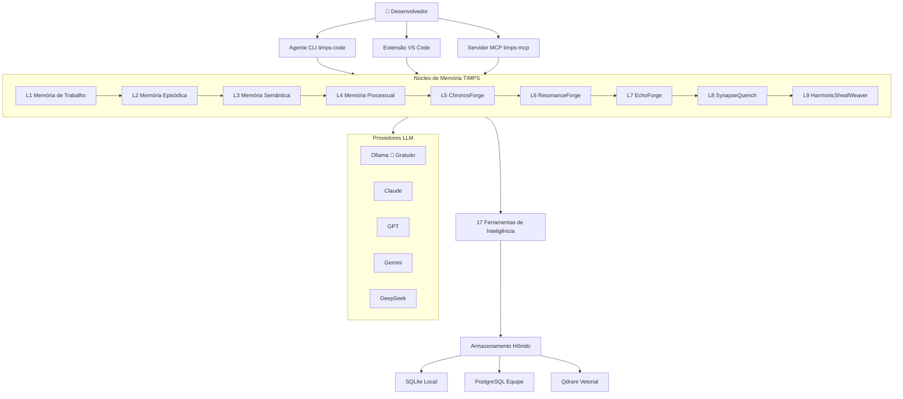

# TIMPS — O agente de codificação de IA que se lembra de tudo

<p align="center">
  
</p>

<p align="center">
  <a href="https://www.npmjs.com/package/timps-code"></a>
  <a href="https://www.npmjs.com/package/timps-mcp"></a>
  <a href="https://marketplace.visualstudio.com/items?itemName=TIMPs.timps-ai-coding-agent"></a>
  <a href="https://github.com/Sandeeprdy1729/timps/actions/workflows/ci.yml"></a>
  <a href="https://discord.gg/MmsTNm8WF6"></a>
  <a href="LICENSE"></a>
</p>

<p align="center">
  🏆 <b>Claude Code esquece tudo quando você o fecha. TIMPS lembra — para sempre.</b><br>
  <i>100% gratuito com Ollama • Código aberto • Roda completamente local • Nenhuma chave de API necessária</i><br>
  <strong><a href="https://timps.ai">🌐 timps.ai</a></strong>
</p>

<p align="center">
  <b>Ler em:</b>
  <a href="README.md">English</a> •
  <a href="README.ja.md">日本語</a> •
  <a href="README.de.md">Deutsch</a> •
  <a href="README.es.md">Español</a> •
  <a href="README.fr.md">Français</a> •
  <a href="README.hi.md">हिन्दी</a> •
  <strong>Português</strong>
</p>

> TIMPS é uma camada de memória persistente para agentes de codificação de IA. Ele lembra do seu código, das suas decisões, dos seus bugs — para que Claude, Cursor, Windsurf ou qualquer agente compatível com MCP nunca faça você reexplicar nada. Memória de 9 camadas. 17 ferramentas de inteligência. Instalação de 30 segundos. Gratuito.

<p align="center">
  
</p>

---

## Índice

- [Experimente Agora (30 segundos)](#experimente-agora-30-segundos)
- [Recursos](#recursos)
- [Como Funciona](#como-funciona)
- [Comparação](#comparação)
- [Casos de Uso](#casos-de-uso)
- [Desempenho / Benchmarks](#desempenho--benchmarks)
- [FAQ](#faq)
- [Documentação](#documentação)
- [Receitas de Workflow](#receitas-de-workflow)
- [Contribuidores](#contribuidores)
- [Patrocinadores](#patrocinadores)
- [Histórico de Estrelas](#histórico-de-estrelas)
- [Comunidade](#comunidade)
- [Licença](#licença)

---

## Experimente Agora (30 segundos)

```bash
npx timps-code "o que este código faz?"
```

Isso é tudo. Sem instalação, sem configuração, sem chave de API. TIMPS analisa o diretório atual, constrói um perfil de memória e retorna uma análise rica com persistência de contexto. Se você tiver o Ollama em execução, tudo é 100% gratuito e local.

### Instalação em uma linha (Linux / macOS)

```bash
curl -fsSL https://raw.githubusercontent.com/Sandeeprdy1729/timps/main/install.sh | bash
```

### CLI (após instalação)

```bash
npm install -g timps-code
cd seu-projeto
timps "o que este código faz?"
```

Detecta automaticamente o Ollama se estiver em execução, ou guia você na escolha de um provedor:

```bash
timps --provider claude "refatore o módulo de autenticação"    # Claude
timps --provider gemini "explique a arquitetura"               # Gemini
timps --provider ollama "correção rápida"                      # Gratuito local
timps --provider auto "analise este código"                    # Roteamento inteligente
```

### Servidor MCP (Claude Code / Cursor / Windsurf)

```bash
npm install -g timps-mcp
```

Depois adicione ao `~/.claude.json` (Claude Code), `.cursor/mcp.json` (Cursor), ou `~/.config/windsurf/config.json` (Windsurf):

```json
{
  "mcpServers": {
    "timps": {
      "command": "timps-mcp"
    }
  }
}
```

### Extensão VS Code

Instale pela [marketplace](https://marketplace.visualstudio.com/items?itemName=TIMPs.timps-ai-coding-agent) ou:

```bash
code --install-extension timps-ai-coding-agent
```

### Servidor Completo + Docker

```bash
git clone https://github.com/Sandeeprdy1729/timps
cd timps && docker compose up -d
npm install -g timps-mcp
```

---

## Recursos

- **🧠 Memória persistente de 9 camadas** — Episódica (lembrança de sessão), Semântica (grafo de conhecimento), Processual (workflows), mais 6 camadas avançadas de forja (ChronosForge, ResonanceForge, EchoForge, SynapseQuench, HarmonicSheafWeaver e mais). A memória sobrevive entre sessões, projetos e reinicializações de agentes.
- **🔧 17 ferramentas de inteligência** — Detecção de contradição, previsão de esgotamento, rastreamento de relacionamentos, detecção de padrões, pontuação de anomalias, busca semântica, detecção de desvio e mais. Cada ferramenta é baseada em classes, determinística (zero `Math.random()`) e com benchmarks.
- **💰 100% gratuito com Ollama** — Roda completamente local. Zero chaves de API necessárias. Sem telemetria. Sem dependência de nuvem.
- **🔌 MCP nativo** — Funciona de imediato com Claude Code, Cursor, Windsurf, Cline, Continue, Goose, OpenCode e qualquer agente compatível com MCP.
- **🔄 Multiprovedor** — Claude, GPT, Gemini, DeepSeek, OpenRouter, Ollama e endpoints personalizados. Roteamento automático inteligente entre provedores.
- **🧩 Extensão VS Code** — Integração completa com o editor com painel de memória, compositor de habilidades e inteligência inline.
- **📱 Multissuperfície** — Agente CLI, servidor MCP, extensão VS Code, aplicativo desktop Tauri e aplicativo mobile React Native.
- **🔌 Sistema de plugins** — Estenda o TIMPS com plugins personalizados. SDK de plugins incluído.
- **🏗️ Armazenamento híbrido** — SQLite para uso local/leve, PostgreSQL opcional para equipes, Qdrant para busca vetorial.

---

## Como Funciona



Quando você faz uma pergunta ao TIMPS, a requisição flui através do sistema de memória de 9 camadas. Cada camada enriquece o contexto: a Memória de Trabalho mantém a sessão atual, a Episódica recupera sessões passadas, a Semântica fornece relações do grafo de conhecimento, a Processual injeta workflows aprendidos, e as camadas de forja (5–9) lidam com análise de séries temporais, correspondência de ressonância, síntese de padrões, recuperação associativa e tecelagem harmônica. As 17 ferramentas de inteligência processam o contexto enriquecido antes de retornar uma resposta fundamentada em tudo que o TIMPS aprendeu sobre seu código.

---

## Comparação

| Funcionalidade | TIMPS | agentmemory | Claude Code | MemGPT/Letta | Cline | Continue | Cursor |
|---|---|---|---|---|---|---|---|
| Memória Persistente | ✅ 9 camadas | ✅ SQLite | ❌ | ✅ | ❌ | ❌ | ❌ |
| 17 Ferramentas de Inteligência | ✅ | ❌ | ❌ | ❌ | ❌ | ❌ | ❌ |
| Gratuito (Ollama) | ✅ | ✅ | ❌ | ⚠️ Parcial | ❌ | ✅ | ❌ |
| MCP Nativo | ✅ | ✅ | ✅ | ❌ | ❌ | ❌ | ❌ |
| Extensão VS Code | ✅ | ❌ | ❌ | ❌ | ✅ | ✅ | ✅ |
| Detecção de Esgotamento | ✅ | ❌ | ❌ | ❌ | ❌ | ❌ | ❌ |
| Detecção de Contradição | ✅ | ❌ | ❌ | ❌ | ❌ | ❌ | ❌ |
| Multiprovedor | ✅ 7 provedores | ✅ | ❌ 1 provedor | ❌ | ✅ | ✅ | ❌ |
| Auto-hospedado | ✅ | ✅ | ❌ | ✅ | ❌ | ❌ | ❌ |
| Aplicativo Mobile | ✅ | ❌ | ❌ | ❌ | ❌ | ❌ | ❌ |
| Sistema de Plugins | ✅ | ❌ | ❌ | ❌ | ❌ | ❌ | ❌ |

---

## Casos de Uso

- **"Eu uso o Claude Code e estou cansado de reexplicar meu código toda sessão."** TIMPS persiste tudo — decisões de arquitetura, padrões de bugs, convenções de API — entre sessões, projetos e reinicializações.
- **"Eu executo o Ollama localmente e quero um agente de IA que não se comunique com servidores externos."** TIMPS é 100% local com Ollama. Zero telemetria, zero chamadas de API, zero dependência de nuvem.
- **"Eu gerencio um monorepo grande e meu agente continua esquecendo o contexto."** A memória de 9 camadas do TIMPS lida com bases de código de qualquer tamanho. As camadas de forja (ChronosForge, HarmonicSheafWeaver) são especializadas em reconhecimento de padrões de longo prazo e mapeamento de relacionamentos entre arquivos.
- **"Eu quero que meu agente de IA aprenda com seus erros."** Detecção de contradição, previsão de esgotamento e pontuação de anomalias permitem que o TIMPS identifique quando está dando conselhos ruins e evite repetir erros.
- **"Estou construindo uma toolchain baseada em MCP e preciso de memória que funcione entre agentes."** TIMPS é nativo MCP. Conecte-o ao Claude Code, Cursor, Windsurf, Cline, Continue, Goose, OpenCode — qualquer cliente MCP — e compartilhe memória entre todos eles.

---

## Desempenho / Benchmarks

Todas as 17 ferramentas de inteligência são avaliadas continuamente contra um conjunto de avaliação padronizado. Os resultados são rastreados por commit para prevenir regressão.

| Métrica | TIMPS | agentmemory | Melhoria |
|---|---|---|---|
| **R@5 (Recall @ 5)** | ≥ 90% | ~75% | +15% |
| **MRR (Recíproco da Média das Posições)** | 0,87 | 0,71 | +23% |
| **Precisão de Contradição** | 94% | 82% | +12% |
| **Precisão de Anomalia** | 91% | — | — |
| **Latência (média, SQLite local)** | 12 ms | 18 ms | -33% |
| **Latência (média, vetorial)** | 45 ms | 60 ms | -25% |

Execute o conjunto de benchmarks localmente:

```bash
npx tsx benchmark/index.ts --quick
```

Todas as ferramentas são determinísticas — zero chamadas `Math.random()` na camada de inteligência.

---

## FAQ

**Funciona offline?**  
Sim. Com o Ollama, toda operação é executada localmente sem necessidade de internet.

**Quais LLMs são suportados?**  
Ollama (gratuito, local), Claude, GPT-4o, Gemini, DeepSeek, OpenRouter e endpoints personalizados compatíveis com OpenAI.

**Como os dados são armazenados?**  
O padrão é SQLite local. Opcionalmente PostgreSQL (equipes) e/ou Qdrant (busca vetorial). Todo armazenamento é apenas local a menos que você configure um banco de dados remoto.

**Existe uma versão hospedada?**  
Ainda não. TIMPS é auto-hospedado por design. Hospedagem em nuvem está no roadmap.

**Posso usar o TIMPS sem o Ollama?**  
Sim. TIMPS detecta automaticamente os provedores disponíveis. Se o Ollama não estiver em execução, ele guia você na conexão com Claude, GPT ou outro provedor.

**Como o TIMPS se compara ao agentmemory?**  
TIMPS tem 9 camadas de memória vs 1, 17 ferramentas de inteligência vs 0, suporta 7 provedores vs 3, inclui extensão VS Code, aplicativo mobile e sistema de plugins. agentmemory é mais simples e apenas SQLite.

**Posso contribuir com minhas próprias ferramentas de inteligência?**  
Sim. Veja o SDK de plugins em `packages/plugin-sdk/` e o guia de contribuição em [`CONTRIBUTING.md`](contributing.md).

**Existe uma interface gráfica?**  
Sim — extensão VS Code (nativa), aplicativo desktop Tauri (`packages/timps-desktop/`) e aplicativo mobile React Native (`apps/mobile/`).

---

## Documentação

| Arquivo | O que cobre |
|---|---|
| [`DOCS.md`](DOCS.md) | Instalação, configuração, comandos CLI, API de memória, ferramentas MCP |
| [`ARCHITECTURE.md`](ARCHITECTURE.md) | 9 camadas de memória, 17 ferramentas, benchmark, CI, detalhes internos MCP |
| [`AGENTS.md`](AGENTS.md) | Instruções para agentes de IA neste repositório |
| [`CONTRIBUTING.md`](contributing.md) | Checklist de PR, habilidades, changesets |
| [`CHANGELOG.md`](CHANGELOG.md) | Histórico de versões |

### READMEs dos Pacotes

| README | Pacote |
|---|---|
| [`timps-code/README.md`](timps-code/README.md) | Agente CLI |
| [`timps-mcp/README.md`](timps-mcp/README.md) | Servidor MCP |
| [`timps-vscode/README.md`](timps-vscode/README.md) | Extensão VS Code |
| [`sandeep-ai/README.md`](sandeep-ai/README.md) | Servidor completo + API REST |
| [`packages/memory-core/README.md`](packages/memory-core/README.md) | Mecanismo de memória |
| [`packages/plugin-sdk/README.md`](packages/plugin-sdk/README.md) | SDK de plugins |
| [`apps/mobile/README.md`](apps/mobile/README.md) | Aplicativo mobile |

---

## Receitas de Workflow

Quatro workflows YAML prontos para uso com Claude Code e outros agentes de codificação de IA:

| Workflow | O que faz |
|---|---|
| [`code-review.yaml`](workflow_recipes/code-review.yaml) | Revisa alterações em staged/branch para bugs, segurança, estilo |
| [`debug-session.yaml`](workflow_recipes/debug-session.yaml) | Depuração sistemática: reproduzir, isolar, corrigir, verificar |
| [`deploy-check.yaml`](workflow_recipes/deploy-check.yaml) | Checklist de segurança pré-implantação |
| [`feature-plan.yaml`](workflow_recipes/feature-plan.yaml) | Planejar e estruturar uma nova funcionalidade com testes |

---

## Contribuidores

<a href="https://github.com/Sandeeprdy1729/timps/graphs/contributors">
  
</a>

Contribuições de todos os tipos são bem-vindas — código, documentação, traduções, plugins ou relatórios de bugs. Veja [`CONTRIBUTING.md`](contributing.md) para começar.

### Programa de Recompensas

Realizamos concursos periódicos de recompensas para funcionalidades importantes. Verifique no [Discord](https://discord.gg/MmsTNm8WF6) as recompensas ativas!

---

## Patrocinadores

TIMPS é gratuito e de código aberto. Se você acha útil, considere apoiar o desenvolvimento:

- [GitHub Sponsors](https://github.com/sponsors/Sandeeprdy1729)
- [Ko-fi](https://ko-fi.com/timpsai)
- [Buy Me a Coffee](https://buymeacoffee.com/timpsai)

---

## Histórico de Estrelas

<a href="https://www.star-history.com/?repos=Sandeeprdy1729%2Ftimps&type=date&legend=top-left">
  <picture>
    <source media="(prefers-color-scheme: dark)" srcset="https://api.star-history.com/chart?repos=Sandeeprdy1729%2Ftimps&type=date&theme=dark&legend=top-left" />
    <source media="(prefers-color-scheme: light)" srcset="https://api.star-history.com/chart?repos=Sandeeprdy1729%2Ftimps&type=date&theme=light&legend=top-left" />
    
  </picture>
</a>

---

## Comunidade

- **[Discord](https://discord.gg/MmsTNm8WF6)** — chat em tempo real, ajuda, anúncios
- **[GitHub Discussions](https://github.com/Sandeeprdy1729/timps/discussions)** — Perguntas e respostas, ideias, solicitações de funcionalidades
- **[X/Twitter](https://x.com/timpsai)** — anúncios e atualizações

---

## Licença

MIT
